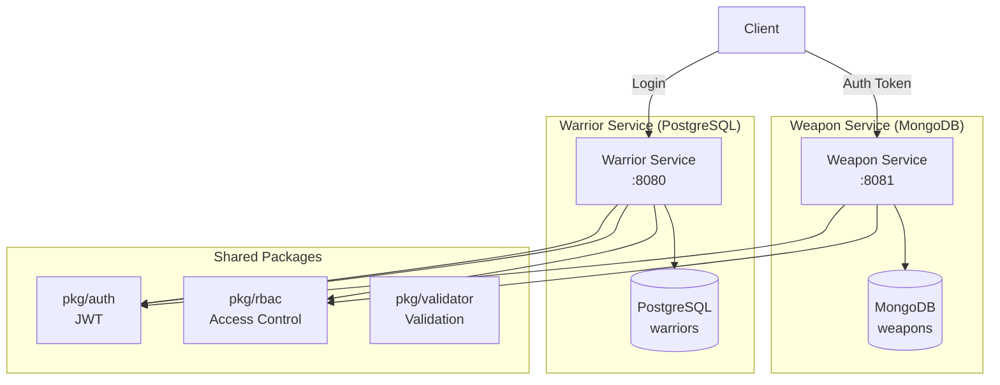
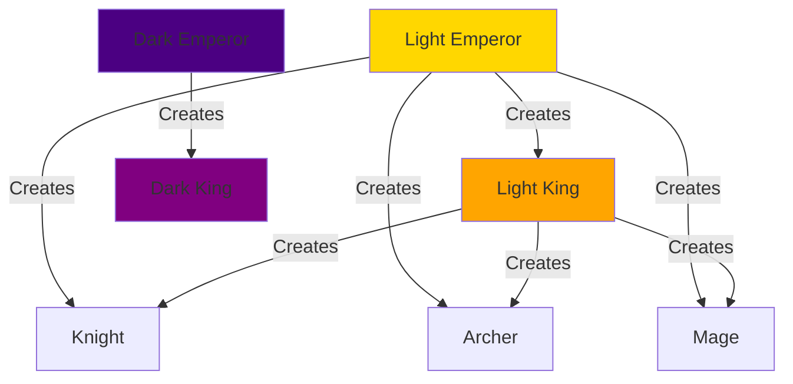
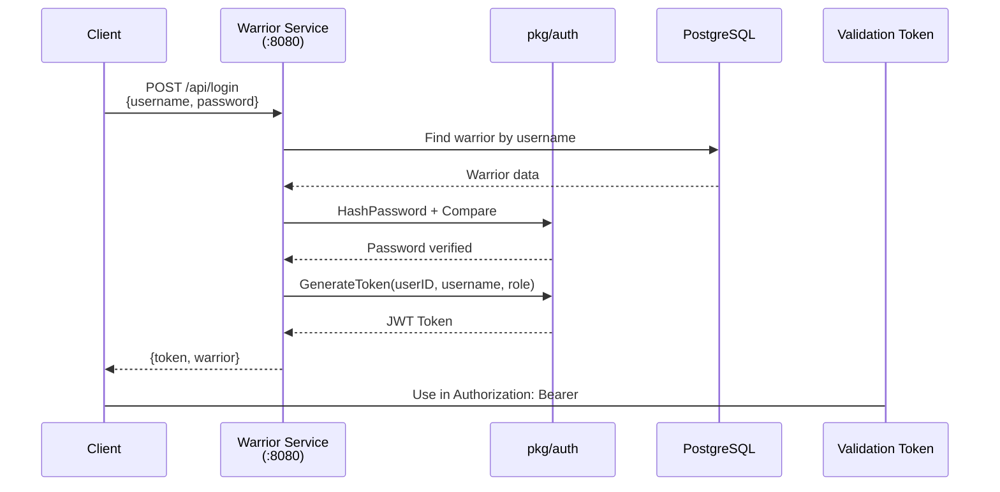
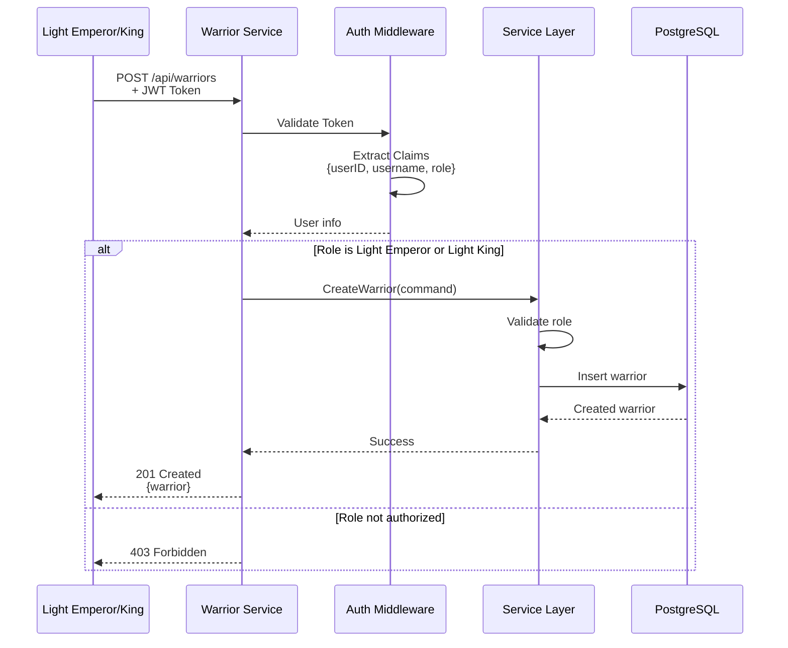
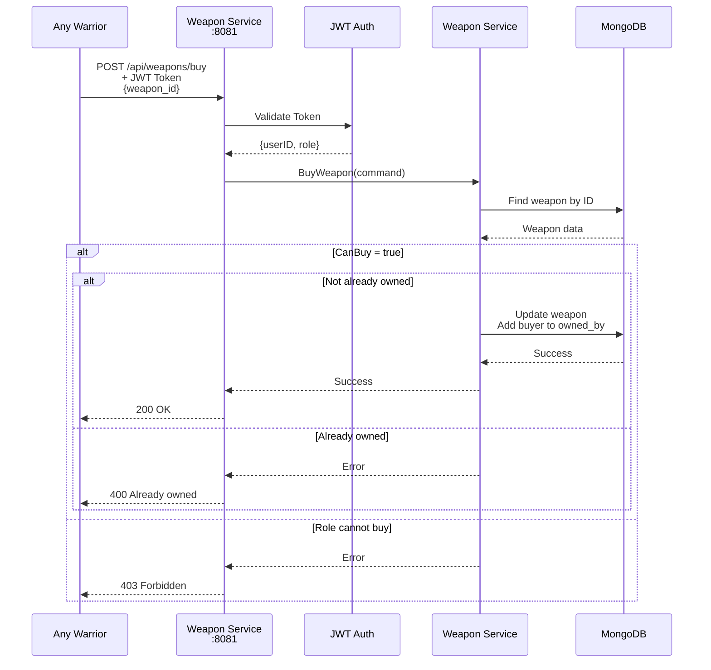
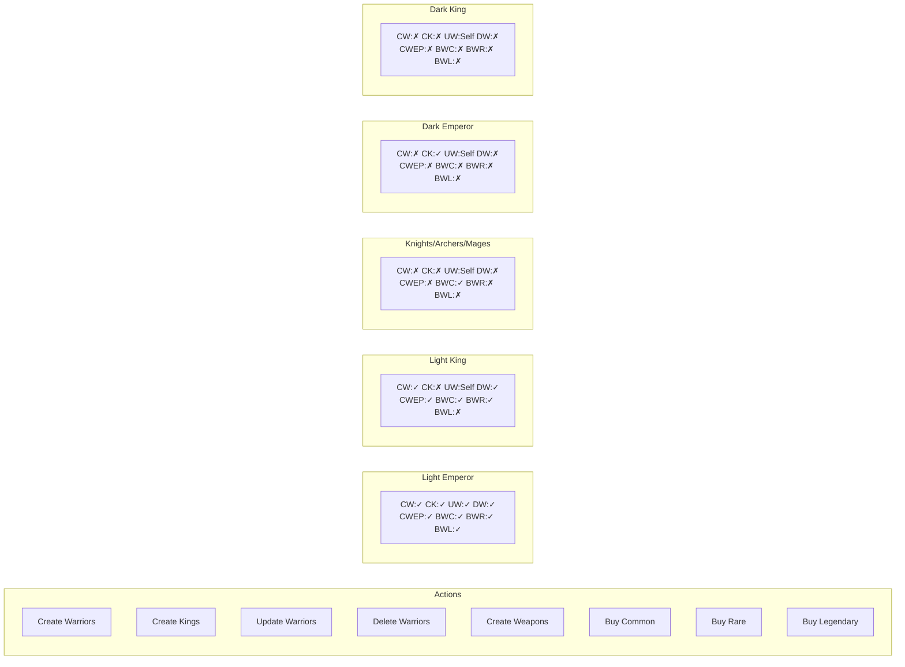
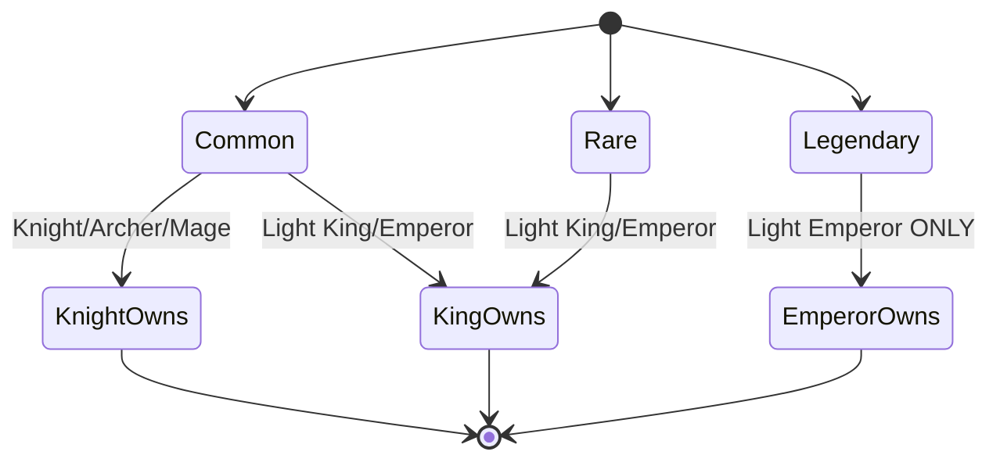
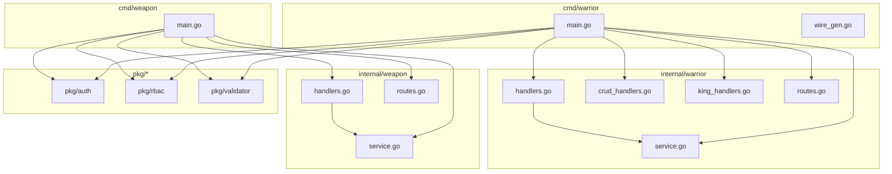

# Empire

A microservices-based role-playing game management system featuring hierarchical roles, role-based access control, and weapon trading. The system is built with Go, using PostgreSQL for warrior management and MongoDB for weapon inventory, following CQRS pattern with Wire dependency injection.

## System Architecture



## Role Hierarchy



## Authentication Flow



## Warrior Creation Flow



## Weapon Purchase Flow



## RBAC Matrix



## Weapon Type Access



## Service Dependencies



## Quick Start

```bash
# Build warrior service
cd cmd/warrior && go run main.go

# Build weapon service  
cd cmd/weapon && go run main.go

# With Docker Compose
docker-compose up -d

# Services
# - Warrior: localhost:8080
# - Weapon: localhost:8081
# - PostgreSQL: localhost:5432
# - MongoDB: localhost:27017
```
