# Empire

A comprehensive microservices-based game system featuring warriors, weapons, coins, enemies, and dragons with role-based access control, gRPC communication, and event-driven architecture using Kafka.

## Architecture Overview

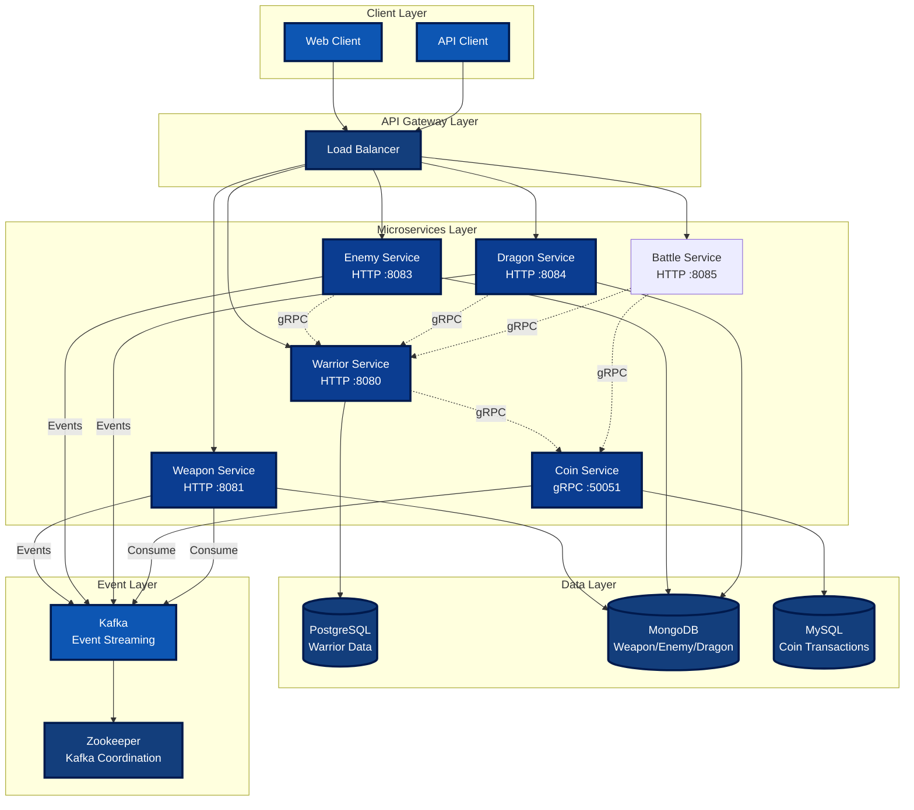

## Service Communication Flow

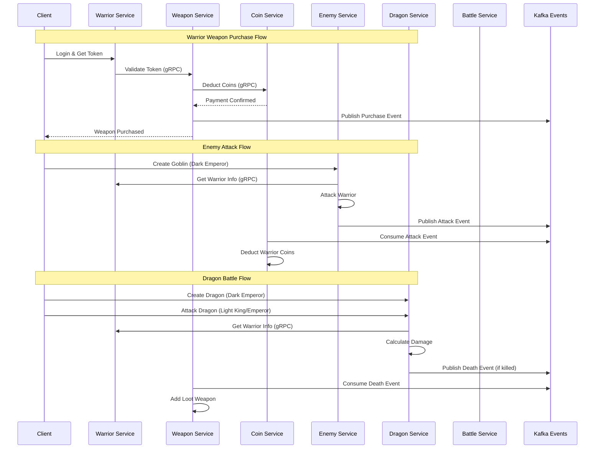

## Role-Based Access Control (RBAC)

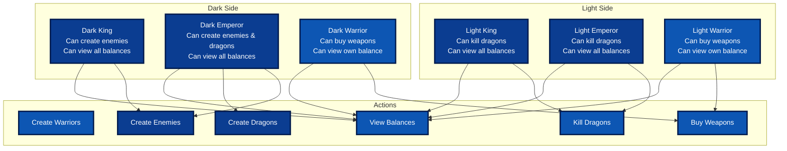

## Database Architecture

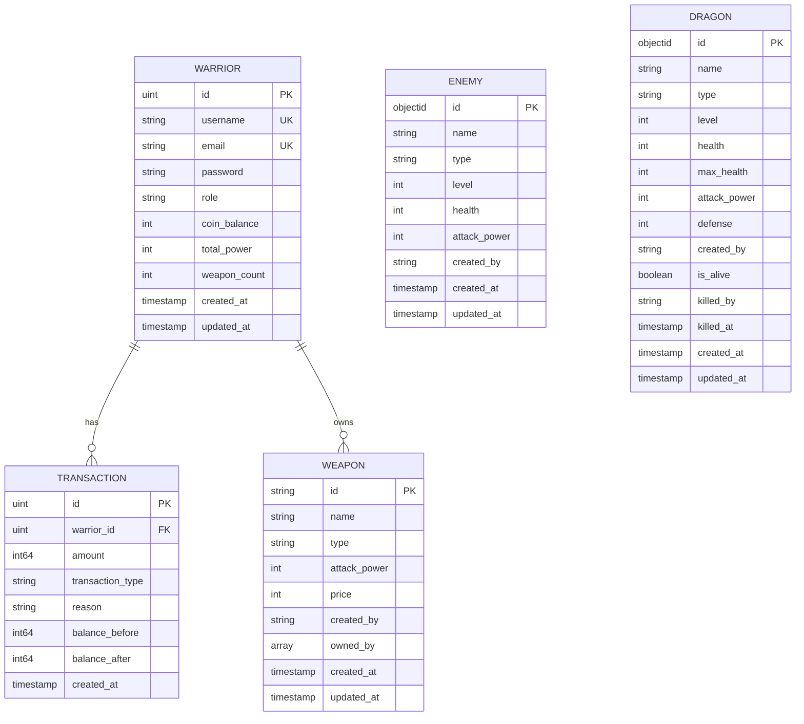

## Event-Driven Architecture

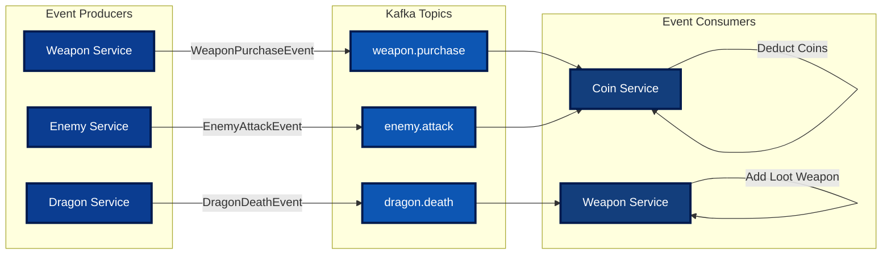

## Gateway Routing and Resilience

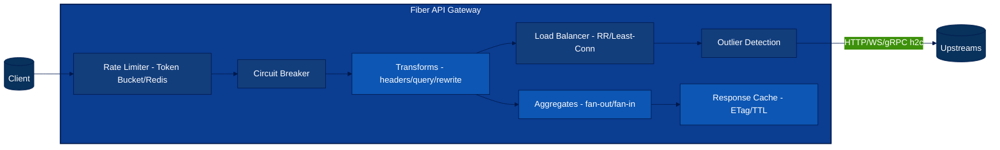

## Docker vs Kubernetes Topology

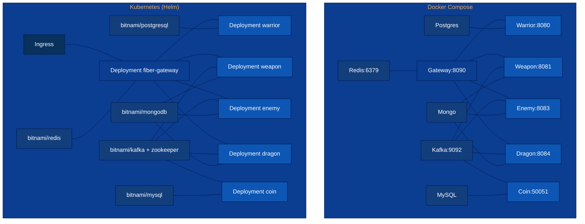

## Kafka Topics (Extended)

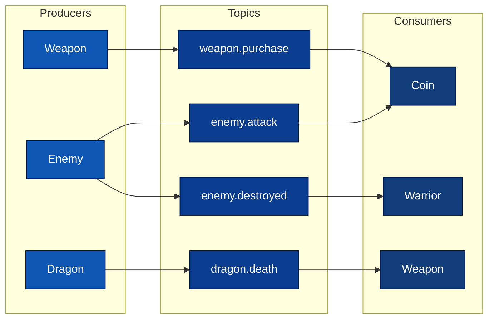

## Deployment Pipeline (Local → Docker → Helm)

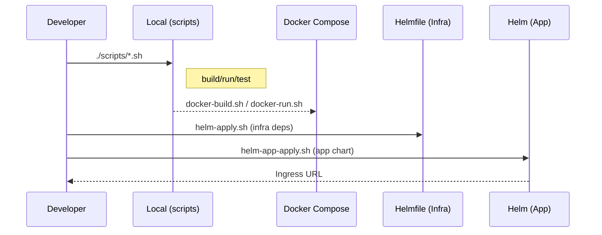

## Service Dependencies

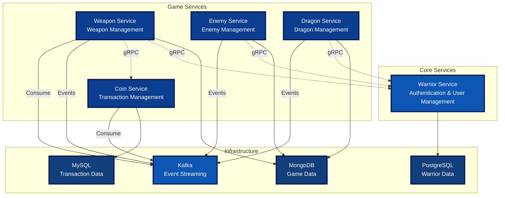

## API Endpoints Overview

```mermaid
graph TB
    subgraph "Warrior Service :8080"
        W1[POST /api/v1/warriors/register]
        W2[POST /api/v1/warriors/login]
        W3[GET /api/v1/warriors/profile]
        W4[PUT /api/v1/warriors/profile]
    end
    
    subgraph "Weapon Service :8081"
        WP1[GET /api/v1/weapons]
        WP2[POST /api/v1/weapons]
        WP3[POST /api/v1/weapons/:id/buy]
        WP4[GET /api/v1/weapons/my-weapons]
    end
    
    subgraph "Coin Service :50051"
        C1[GetBalance]
        C2[DeductCoins]
        C3[AddCoins]
        C4[TransferCoins]
        C5[GetTransactionHistory]
    end
    
    subgraph "Enemy Service :8083"
        E1[POST /api/v1/enemies]
        E2[POST /api/v1/enemies/:id/attack]
        E3[GET /api/v1/enemies]
        E4[GET /api/v1/enemies/type/:type]
    end
    
    subgraph "Dragon Service :8084"
        D1[POST /api/v1/dragons]
        D2[POST /api/v1/dragons/:id/attack]
        D3[GET /api/v1/dragons/:id]
        D4[GET /api/v1/dragons/type/:type]
    end
    
    subgraph "Battle Service :8085"
        B1[POST /api/battles]
        B2[POST /api/battles/attack]
        B3[GET /api/battles/:id]
        B4[GET /api/battles/my-battles]
        B5[GET /api/battles/stats]
        B6[GET /api/battles/:id/turns]
    end
    
    style W1 fill:#0d56b3,stroke:#001a4d,stroke-width:3px,color:#ffffff
    style W2 fill:#0d56b3,stroke:#001a4d,stroke-width:3px,color:#ffffff
    style W3 fill:#0d56b3,stroke:#001a4d,stroke-width:3px,color:#ffffff
    style W4 fill:#0d56b3,stroke:#001a4d,stroke-width:3px,color:#ffffff
    style WP1 fill:#0b3d91,stroke:#001a4d,stroke-width:3px,color:#ffffff
    style WP2 fill:#0b3d91,stroke:#001a4d,stroke-width:3px,color:#ffffff
    style WP3 fill:#0b3d91,stroke:#001a4d,stroke-width:3px,color:#ffffff
    style WP4 fill:#0b3d91,stroke:#001a4d,stroke-width:3px,color:#ffffff
    style C1 fill:#133e7c,stroke:#001a4d,stroke-width:3px,color:#ffffff
    style C2 fill:#133e7c,stroke:#001a4d,stroke-width:3px,color:#ffffff
    style C3 fill:#133e7c,stroke:#001a4d,stroke-width:3px,color:#ffffff
    style C4 fill:#133e7c,stroke:#001a4d,stroke-width:3px,color:#ffffff
    style C5 fill:#133e7c,stroke:#001a4d,stroke-width:3px,color:#ffffff
    style E1 fill:#0b3d91,stroke:#001a4d,stroke-width:3px,color:#ffffff
    style E2 fill:#0b3d91,stroke:#001a4d,stroke-width:3px,color:#ffffff
    style E3 fill:#0b3d91,stroke:#001a4d,stroke-width:3px,color:#ffffff
    style E4 fill:#0b3d91,stroke:#001a4d,stroke-width:3px,color:#ffffff
    style D1 fill:#0d56b3,stroke:#001a4d,stroke-width:3px,color:#ffffff
    style D2 fill:#0d56b3,stroke:#001a4d,stroke-width:3px,color:#ffffff
    style D3 fill:#0d56b3,stroke:#001a4d,stroke-width:3px,color:#ffffff
    style D4 fill:#0d56b3,stroke:#001a4d,stroke-width:3px,color:#ffffff
    style B1 fill:#133e7c,stroke:#001a4d,stroke-width:3px,color:#ffffff
    style B2 fill:#133e7c,stroke:#001a4d,stroke-width:3px,color:#ffffff
    style B3 fill:#133e7c,stroke:#001a4d,stroke-width:3px,color:#ffffff
    style B4 fill:#133e7c,stroke:#001a4d,stroke-width:3px,color:#ffffff
    style B5 fill:#133e7c,stroke:#001a4d,stroke-width:3px,color:#ffffff
    style B6 fill:#133e7c,stroke:#001a4d,stroke-width:3px,color:#ffffff
```

## Game Flow Examples

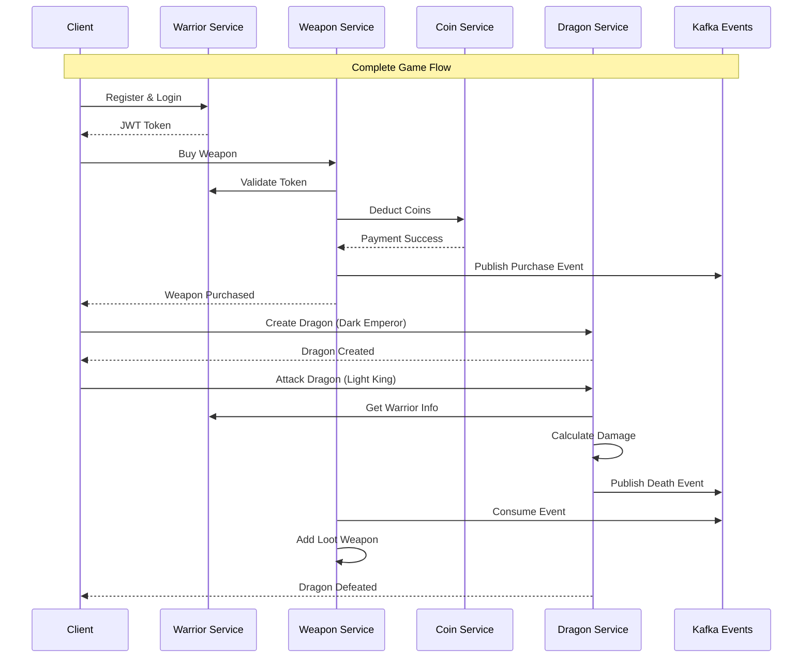

## API Documentation (Swagger/OpenAPI)

Tüm HTTP servisleri için Swagger/OpenAPI dokümantasyonu mevcuttur. Swagger UI ile API endpoint'lerini test edebilir ve detaylı dokümantasyona erişebilirsiniz.

### Swagger UI URL'leri

- **Warrior Service**: http://localhost:8080/swagger/index.html
- **Weapon Service**: http://localhost:8081/swagger/index.html
- **Dragon Service**: http://localhost:8084/swagger/index.html
- **Battle Service**: http://localhost:8085/swagger/index.html

### Swagger Dokümantasyonlarını Generate Etme

Swagger dokümantasyonlarını yeniden oluşturmak için:

```bash
# Otomatik script ile tüm servisler için
./scripts/swagger-gen.sh

# Veya manuel olarak her servis için
cd cmd/warrior && swag init --parseDependency --parseInternal
cd cmd/weapon && swag init --parseDependency --parseInternal
cd cmd/dragon && swag init --parseDependency --parseInternal
cd cmd/battle && swag init --parseDependency --parseInternal
```

### Authentication

Çoğu endpoint JWT token ile korunmaktadır. Swagger UI'da token kullanmak için:

1. Swagger UI'ın sağ üstündeki **"Authorize"** 🔒 butonuna tıklayın
2. `Bearer <your-jwt-token>` formatında token'ı girin
3. Örnek: `Bearer eyJhbGciOiJIUzI1NiIsInR5cCI6IkpXVCJ9...`

Token almak için `/api/login` endpoint'ini kullanabilirsiniz.

### Servis Bazlı Endpoint'ler

#### Warrior Service
- Authentication: Login, Profile
- Warrior Management: CRUD operations (King only)
- Profile: Password change, Killed monsters, Strongest kill
- Role-based: Knights, Archers, Mages listing

#### Weapon Service
- Weapon Listing: Get all weapons, filter by type
- Weapon Purchase: Buy weapons (triggers Kafka events)
- My Weapons: List owned weapons
- Admin: Create weapons (Light Emperor/King only)

#### Dragon Service
- Dragon Management: Create, Attack, Get by ID
- Filtering: Get by type, Get by creator
- Events: Dragon death events published to Kafka

#### Battle Service
- Battle Management: Start battle, Attack, Get battle details
- Battle History: Get battles with RBAC (Emperors see all, Kings see faction, Warriors see own)
- Battle Statistics: Win rate, total battles, coins/experience earned
- Turn-based Combat: Turn history, damage tracking
- Rewards: Automatic coin rewards/penalties via gRPC

### Notlar

- **Coin Service**: gRPC servis olduğu için protobuf dosyalarından dokümantasyon oluşturulabilir (`api/proto/coin/coin.proto`)
- **Enemy Service**: Şu anda HTTP endpoint'leri implement edilmemiştir (sadece Kafka consumer)
- **API Gateway**: Gateway üzerinden erişilen servislerin dokümantasyonları kendi servis portlarından erişilebilir