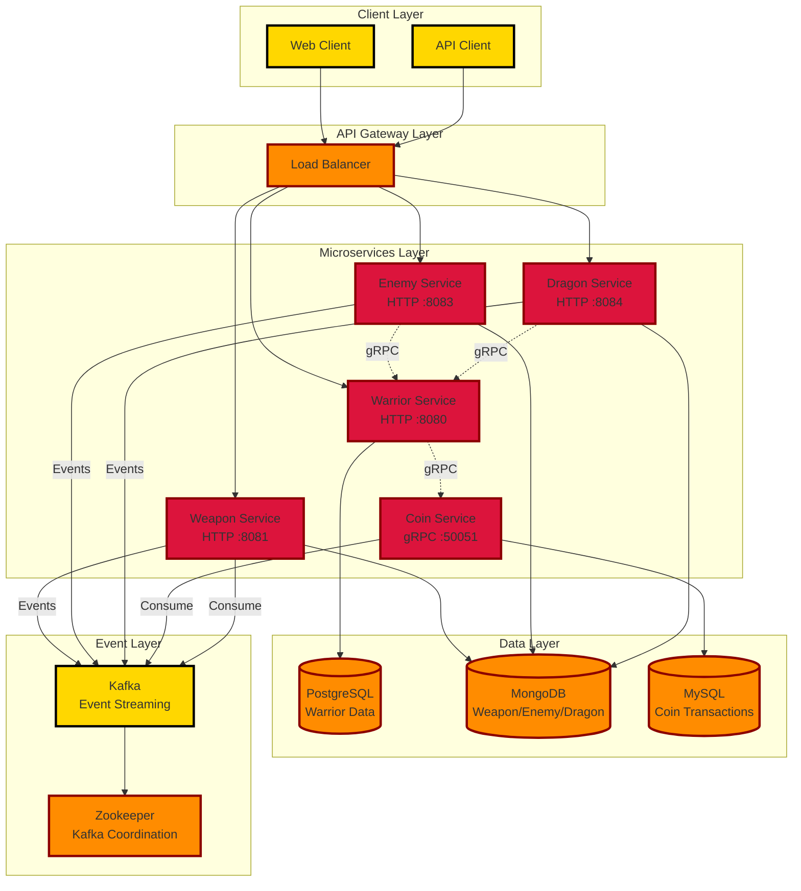
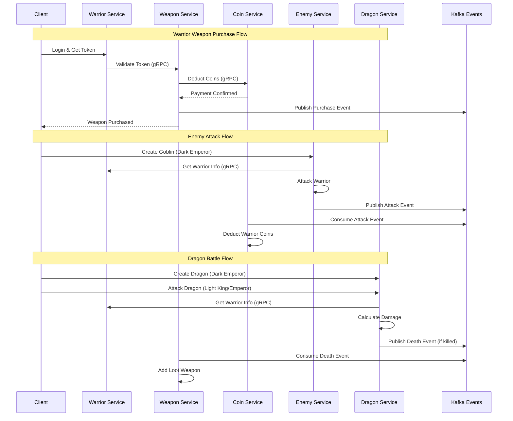
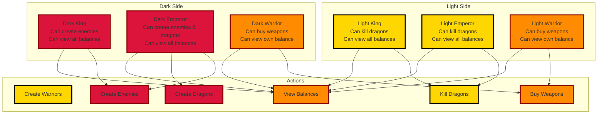
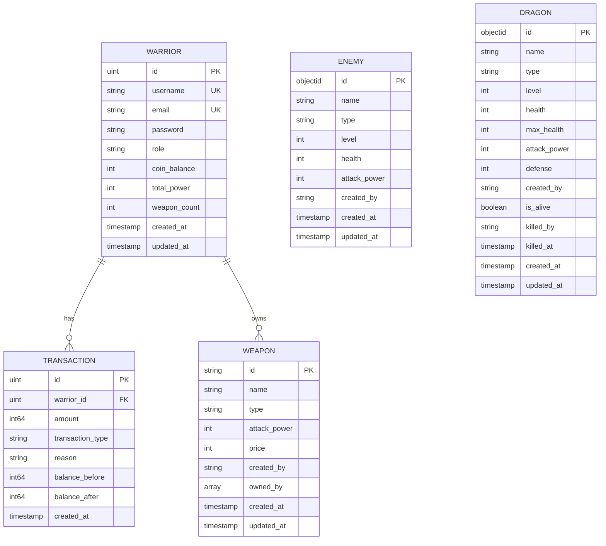
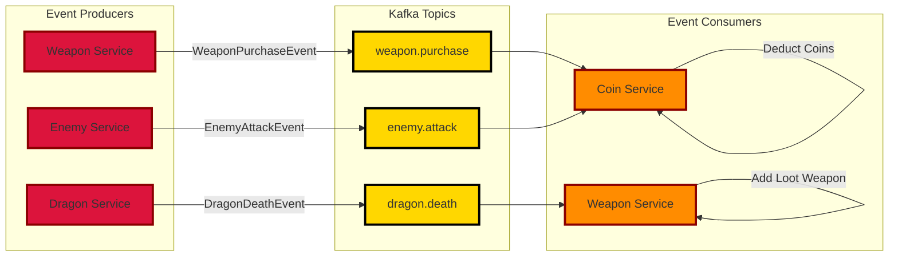
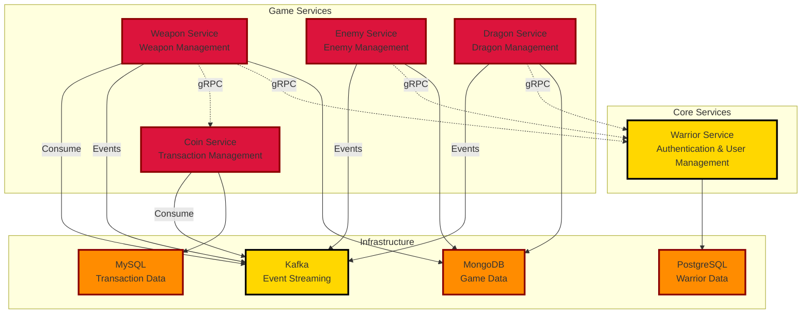
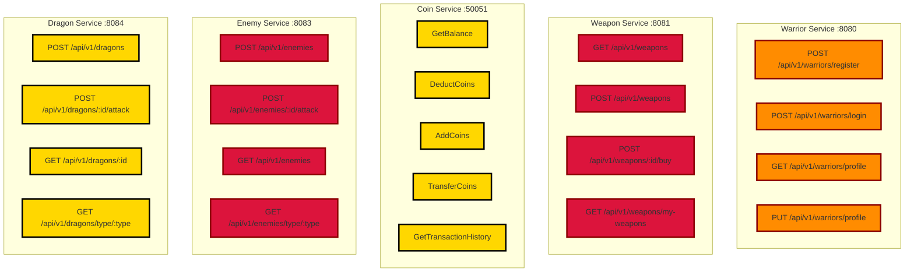
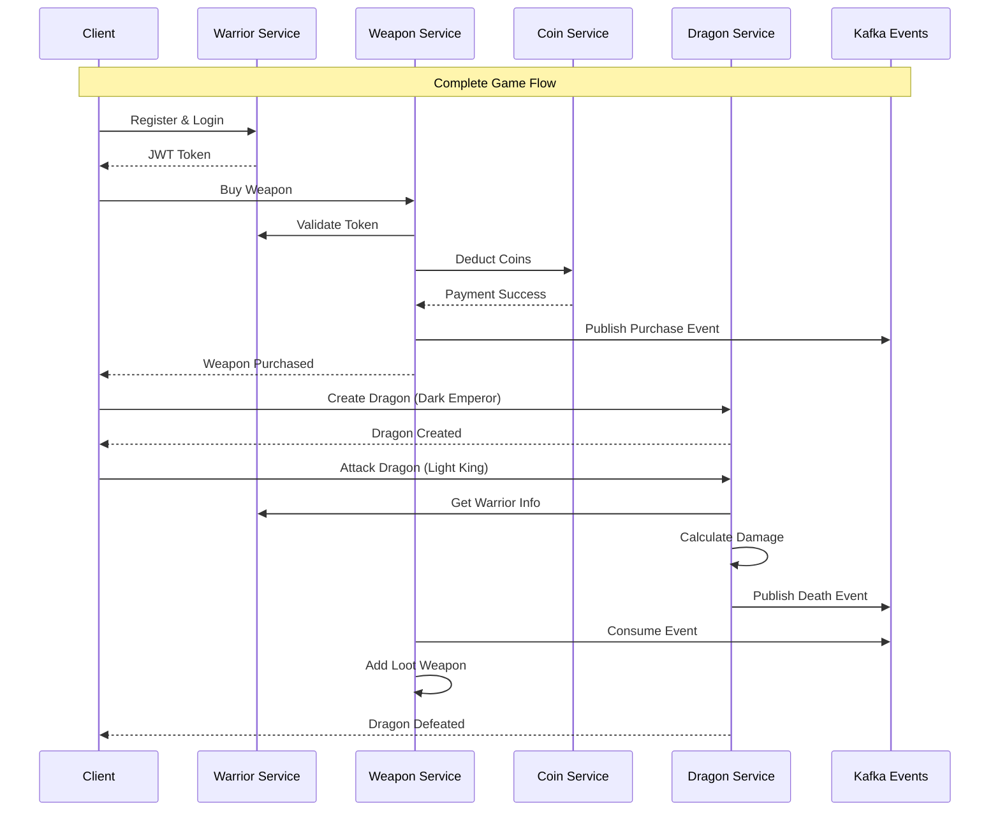

# Empire

A comprehensive microservices-based game system featuring warriors, weapons, coins, enemies, and dragons with role-based access control, gRPC communication, and event-driven architecture using Kafka.

## Architecture Overview

## Service Communication Flow

## Role-Based Access Control (RBAC)

## Database Architecture

## Event-Driven Architecture

## Service Dependencies

## API Endpoints Overview

## Game Flow Examples

