# Empire

A comprehensive microservices-based game system featuring warriors, weapons, coins, enemies, dragons, battles, spells, and arena with role-based access control, gRPC communication, and event-driven architecture using Kafka.

## Architecture Overview

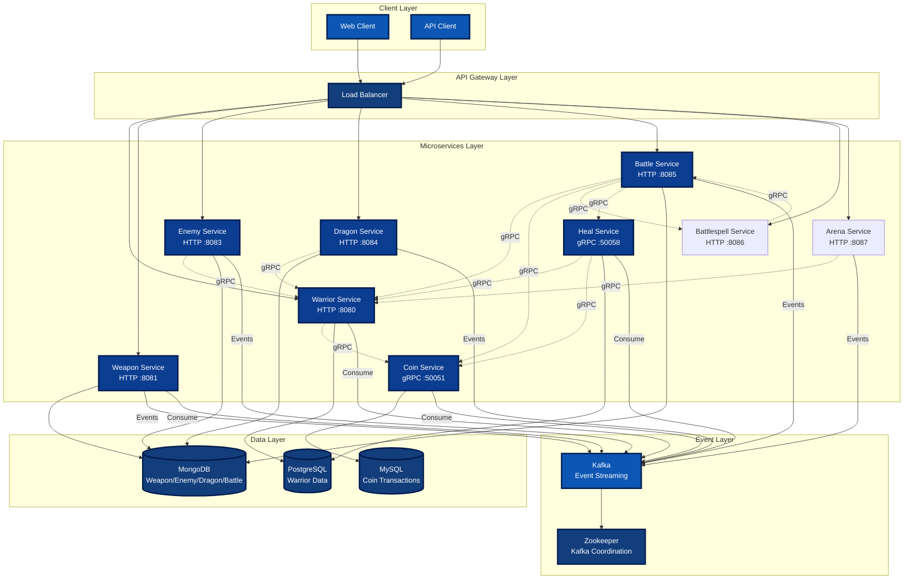
```mermaid
graph TB
    subgraph "Client Layer"
        WEB[Web Client]
        API[API Client]
    end
    
    subgraph "API Gateway Layer"
        LB[Load Balancer]
    end
    
    subgraph "Microservices Layer"
        W[Warrior Service<br/>HTTP :8080]
        WP[Weapon Service<br/>HTTP :8081]
        C[Coin Service<br/>gRPC :50051]
        E[Enemy Service<br/>HTTP :8083]
        D[Dragon Service<br/>HTTP :8084]
        B[Battle Service<br/>HTTP :8085]
        BS[Battlespell Service<br/>HTTP :8086]
        A[Arena Service<br/>HTTP :8087]
        H[Heal Service<br/>gRPC :50058]
    end
    
    subgraph "Data Layer"
        PG[(PostgreSQL<br/>Warrior Data)]
        MG[(MongoDB<br/>Weapon/Enemy/Dragon/Battle)]
        MY[(MySQL<br/>Coin Transactions)]
    end
    
    subgraph "Event Layer"
        K[Kafka<br/>Event Streaming]
        Z[Zookeeper<br/>Kafka Coordination]
    end
    
    WEB --> LB
    API --> LB
    LB --> W
    LB --> WP
    LB --> E
    LB --> D
    LB --> B
    LB --> BS
    LB --> A
    
    W -.->|gRPC| C
    E -.->|gRPC| W
    D -.->|gRPC| W
    B -.->|gRPC| W
    B -.->|gRPC| C
    B -.->|gRPC| BS
    B -.->|gRPC| H
    BS -.->|gRPC| B
    A -.->|gRPC| W
    H -.->|gRPC| W
    H -.->|gRPC| C
    
    W --> PG
    WP --> MG
    E --> MG
    D --> MG
    B --> MG
    C --> MY
    H --> PG
    
    WP -->|Events| K
    E -->|Events| K
    D -->|Events| K
    B -->|Events| K
    A -->|Events| K
    C -->|Consume| K
    WP -->|Consume| K
    W -->|Consume| K
    H -->|Consume| K
    
    K --> Z
    
    style WEB fill:#0d56b3,stroke:#001a4d,stroke-width:3px,color:#ffffff
    style API fill:#0d56b3,stroke:#001a4d,stroke-width:3px,color:#ffffff
    style LB fill:#133e7c,stroke:#001a4d,stroke-width:3px,color:#ffffff
    style W fill:#0b3d91,stroke:#001a4d,stroke-width:3px,color:#ffffff
    style WP fill:#0b3d91,stroke:#001a4d,stroke-width:3px,color:#ffffff
    style C fill:#0b3d91,stroke:#001a4d,stroke-width:3px,color:#ffffff
    style E fill:#0b3d91,stroke:#001a4d,stroke-width:3px,color:#ffffff
    style D fill:#0b3d91,stroke:#001a4d,stroke-width:3px,color:#ffffff
    style B fill:#0b3d91,stroke:#001a4d,stroke-width:3px,color:#ffffff
    style H fill:#0b3d91,stroke:#001a4d,stroke-width:3px,color:#ffffff
    style PG fill:#133e7c,stroke:#001a4d,stroke-width:3px,color:#ffffff
    style MG fill:#133e7c,stroke:#001a4d,stroke-width:3px,color:#ffffff
    style MY fill:#133e7c,stroke:#001a4d,stroke-width:3px,color:#ffffff
    style K fill:#0d56b3,stroke:#001a4d,stroke-width:3px,color:#ffffff
    style Z fill:#133e7c,stroke:#001a4d,stroke-width:3px,color:#ffffff
```

## Service Communication Flow

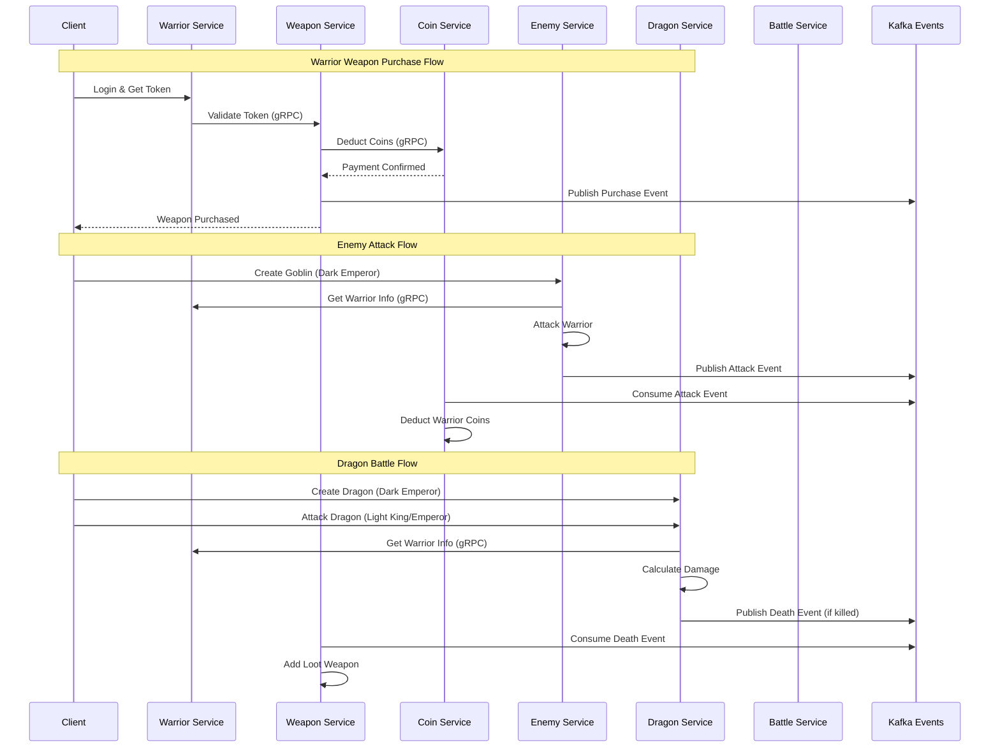
```mermaid
sequenceDiagram
    participant Client
    participant Warrior as Warrior Service
    participant Weapon as Weapon Service
    participant Coin as Coin Service
    participant Enemy as Enemy Service
    participant Dragon as Dragon Service
    participant Battle as Battle Service
    participant Kafka as Kafka Events
    
    Note over Client,Dragon: Warrior Weapon Purchase Flow
    Client->>Warrior: Login & Get Token
    Warrior->>Weapon: Validate Token (gRPC)
    Weapon->>Coin: Deduct Coins (gRPC)
    Coin-->>Weapon: Payment Confirmed
    Weapon->>Kafka: Publish Purchase Event
    Weapon-->>Client: Weapon Purchased
    
    Note over Client,Dragon: Enemy Attack Flow
    Client->>Enemy: Create Goblin (Dark Emperor)
    Enemy->>Warrior: Get Warrior Info (gRPC)
    Enemy->>Enemy: Attack Warrior
    Enemy->>Kafka: Publish Attack Event
    Coin->>Kafka: Consume Attack Event
    Coin->>Coin: Deduct Warrior Coins
    
    Note over Client,Dragon: Dragon Battle Flow
    Client->>Dragon: Create Dragon (Dark Emperor)
    Client->>Dragon: Attack Dragon (Light King/Emperor)
    Dragon->>Warrior: Get Warrior Info (gRPC)
    Dragon->>Dragon: Calculate Damage
    Dragon->>Kafka: Publish Death Event (if killed)
    Weapon->>Kafka: Consume Death Event
    Weapon->>Weapon: Add Loot Weapon
```

## Role-Based Access Control (RBAC)

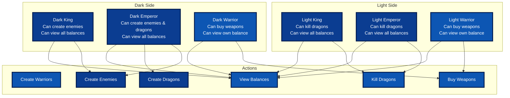
```mermaid
graph TD
    subgraph "Light Side"
        LK[Light King<br/>Can kill dragons<br/>Can view all balances]
        LE[Light Emperor<br/>Can kill dragons<br/>Can view all balances]
        LW[Light Warrior<br/>Can buy weapons<br/>Can view own balance]
    end
    
    subgraph "Dark Side"
        DK[Dark King<br/>Can create enemies<br/>Can view all balances]
        DE[Dark Emperor<br/>Can create enemies & dragons<br/>Can view all balances]
        DW[Dark Warrior<br/>Can buy weapons<br/>Can view own balance]
    end
    
    subgraph "Actions"
        A1[Create Warriors]
        A2[Buy Weapons]
        A3[Create Enemies]
        A4[Create Dragons]
        A5[Kill Dragons]
        A6[View Balances]
    end
    
    LK --> A5
    LK --> A6
    LE --> A5
    LE --> A6
    LW --> A2
    LW --> A6
    
    DK --> A3
    DK --> A6
    DE --> A3
    DE --> A4
    DE --> A6
    DW --> A2
    DW --> A6
    
    style LK fill:#0b3d91,stroke:#001a4d,stroke-width:3px,color:#ffffff
    style LE fill:#0b3d91,stroke:#001a4d,stroke-width:3px,color:#ffffff
    style LW fill:#0d56b3,stroke:#001a4d,stroke-width:3px,color:#ffffff
    style DK fill:#0b3d91,stroke:#001a4d,stroke-width:3px,color:#ffffff
    style DE fill:#0b3d91,stroke:#001a4d,stroke-width:3px,color:#ffffff
    style DW fill:#0d56b3,stroke:#001a4d,stroke-width:3px,color:#ffffff
    style A1 fill:#0d56b3,stroke:#001a4d,stroke-width:3px,color:#ffffff
    style A2 fill:#0d56b3,stroke:#001a4d,stroke-width:3px,color:#ffffff
    style A3 fill:#0b3d91,stroke:#001a4d,stroke-width:3px,color:#ffffff
    style A4 fill:#0b3d91,stroke:#001a4d,stroke-width:3px,color:#ffffff
    style A5 fill:#0d56b3,stroke:#001a4d,stroke-width:3px,color:#ffffff
    style A6 fill:#0d56b3,stroke:#001a4d,stroke-width:3px,color:#ffffff
```

## Database Architecture

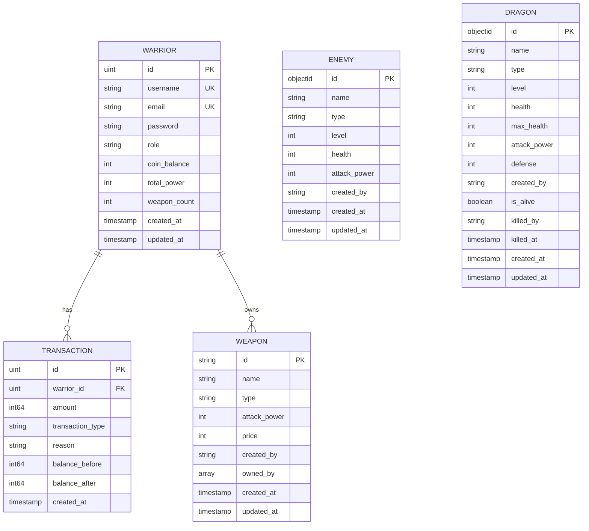
```mermaid
erDiagram
    WARRIOR {
        uint id PK
        string username UK
        string email UK
        string password
        string role
        int coin_balance
        int total_power
        int weapon_count
        timestamp created_at
        timestamp updated_at
    }
    
    WEAPON {
        string id PK
        string name
        string type
        int attack_power
        int price
        string created_by
        array owned_by
        timestamp created_at
        timestamp updated_at
    }
    
    TRANSACTION {
        uint id PK
        uint warrior_id FK
        int64 amount
        string transaction_type
        string reason
        int64 balance_before
        int64 balance_after
        timestamp created_at
    }
    
    ENEMY {
        objectid id PK
        string name
        string type
        int level
        int health
        int attack_power
        string created_by
        timestamp created_at
        timestamp updated_at
    }
    
    DRAGON {
        objectid id PK
        string name
        string type
        int level
        int health
        int max_health
        int attack_power
        int defense
        string created_by
        boolean is_alive
        string killed_by
        timestamp killed_at
        timestamp created_at
        timestamp updated_at
    }
    
    WARRIOR ||--o{ TRANSACTION : "has"
    WARRIOR ||--o{ WEAPON : "owns"
```

## Event-Driven Architecture

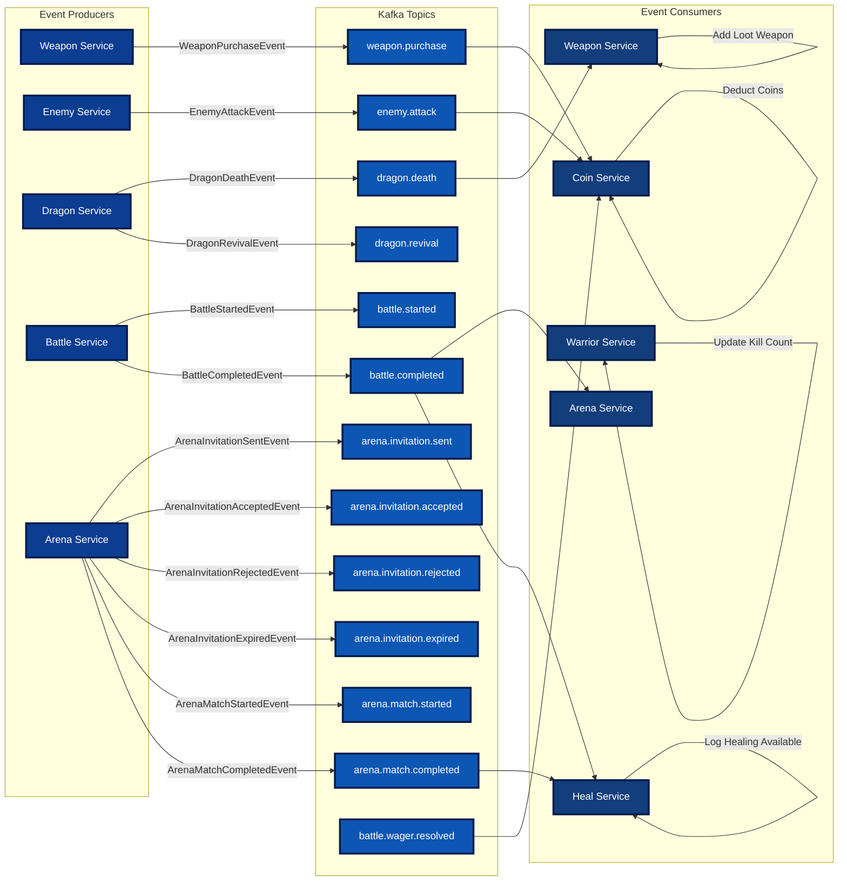
```mermaid
graph LR
    subgraph "Event Producers"
        WP[Weapon Service]
        E[Enemy Service]
        D[Dragon Service]
        B[Battle Service]
        A[Arena Service]
    end
    
    subgraph "Kafka Topics"
        T1[weapon.purchase]
        T2[enemy.attack]
        T3[dragon.death]
        T4[dragon.revival]
        T5[battle.started]
        T6[battle.completed]
        T7[arena.invitation.sent]
        T8[arena.invitation.accepted]
        T9[arena.invitation.rejected]
        T10[arena.invitation.expired]
        T11[arena.match.started]
        T12[arena.match.completed]
        T13[battle.wager.resolved]
    end
    
    subgraph "Event Consumers"
        C[Coin Service]
        WP2[Weapon Service]
        W[Warrior Service]
        A2[Arena Service]
        H[Heal Service]
    end
    
    WP -->|WeaponPurchaseEvent| T1
    E -->|EnemyAttackEvent| T2
    D -->|DragonDeathEvent| T3
    D -->|DragonRevivalEvent| T4
    B -->|BattleStartedEvent| T5
    B -->|BattleCompletedEvent| T6
    A -->|ArenaInvitationSentEvent| T7
    A -->|ArenaInvitationAcceptedEvent| T8
    A -->|ArenaInvitationRejectedEvent| T9
    A -->|ArenaInvitationExpiredEvent| T10
    A -->|ArenaMatchStartedEvent| T11
    A -->|ArenaMatchCompletedEvent| T12
    
    T1 --> C
    T2 --> C
    T3 --> WP2
    T6 --> A2
    T6 --> H
    T12 --> H
    T13 --> C
    
    C -->|Deduct Coins| C
    WP2 -->|Add Loot Weapon| WP2
    W -->|Update Kill Count| W
    H -->|Log Healing Available| H
    
    style WP fill:#0b3d91,stroke:#001a4d,stroke-width:3px,color:#ffffff
    style E fill:#0b3d91,stroke:#001a4d,stroke-width:3px,color:#ffffff
    style D fill:#0b3d91,stroke:#001a4d,stroke-width:3px,color:#ffffff
    style B fill:#0b3d91,stroke:#001a4d,stroke-width:3px,color:#ffffff
    style A fill:#0b3d91,stroke:#001a4d,stroke-width:3px,color:#ffffff
    style T1 fill:#0d56b3,stroke:#001a4d,stroke-width:3px,color:#ffffff
    style T2 fill:#0d56b3,stroke:#001a4d,stroke-width:3px,color:#ffffff
    style T3 fill:#0d56b3,stroke:#001a4d,stroke-width:3px,color:#ffffff
    style T4 fill:#0d56b3,stroke:#001a4d,stroke-width:3px,color:#ffffff
    style T5 fill:#0d56b3,stroke:#001a4d,stroke-width:3px,color:#ffffff
    style T6 fill:#0d56b3,stroke:#001a4d,stroke-width:3px,color:#ffffff
    style T7 fill:#0d56b3,stroke:#001a4d,stroke-width:3px,color:#ffffff
    style T8 fill:#0d56b3,stroke:#001a4d,stroke-width:3px,color:#ffffff
    style T9 fill:#0d56b3,stroke:#001a4d,stroke-width:3px,color:#ffffff
    style T10 fill:#0d56b3,stroke:#001a4d,stroke-width:3px,color:#ffffff
    style T11 fill:#0d56b3,stroke:#001a4d,stroke-width:3px,color:#ffffff
    style T12 fill:#0d56b3,stroke:#001a4d,stroke-width:3px,color:#ffffff
    style C fill:#133e7c,stroke:#001a4d,stroke-width:3px,color:#ffffff
    style WP2 fill:#133e7c,stroke:#001a4d,stroke-width:3px,color:#ffffff
    style W fill:#133e7c,stroke:#001a4d,stroke-width:3px,color:#ffffff
    style A2 fill:#133e7c,stroke:#001a4d,stroke-width:3px,color:#ffffff
    style H fill:#133e7c,stroke:#001a4d,stroke-width:3px,color:#ffffff
    style T13 fill:#0d56b3,stroke:#001a4d,stroke-width:3px,color:#ffffff
```

## Gateway Routing and Resilience

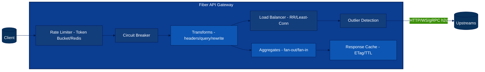
```mermaid
%%{init: {
  'theme': 'base',
  'themeVariables': {
    'primaryColor': '#0b3d91',
    'primaryTextColor': '#ffffff',
    'primaryBorderColor': '#001a4d',
    'lineColor': '#001a4d',
    'tertiaryColor': '#0d56b3',
    'clusterBkg': '#0b3d91',
    'clusterBorder': '#001a4d'
  }
}}%%
flowchart LR
    subgraph GW["Fiber API Gateway"]
        RL[Rate Limiter - Token Bucket/Redis]
        CB[Circuit Breaker]
        LB[Load Balancer - RR/Least-Conn]
        OD[Outlier Detection]
        TR[Transforms - headers/query/rewrite]
        AGG[Aggregates - fan-out/fan-in]
        CACHE[Response Cache - ETag/TTL]
    end

    C[(Client)] --> RL --> CB --> TR --> LB --> OD -->|HTTP/WS/gRPC h2c| UP[(Upstreams)]
    TR --> AGG --> CACHE

    style GW fill:#0b3d91,stroke:#001a4d,stroke-width:2px,color:#ffffff
    style RL fill:#133e7c,stroke:#001a4d,color:#ffffff
    style CB fill:#133e7c,stroke:#001a4d,color:#ffffff
    style LB fill:#133e7c,stroke:#001a4d,color:#ffffff
    style OD fill:#133e7c,stroke:#001a4d,color:#ffffff
    style TR fill:#0d56b3,stroke:#001a4d,color:#ffffff
    style AGG fill:#0d56b3,stroke:#001a4d,color:#ffffff
    style CACHE fill:#0d56b3,stroke:#001a4d,color:#ffffff
    style C fill:#08315c,stroke:#001a4d,color:#ffffff
    style UP fill:#08315c,stroke:#001a4d,color:#ffffff
```

## Docker vs Kubernetes Topology

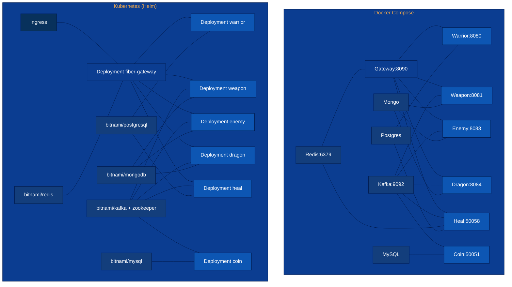
```mermaid
%%{init: {
  'theme': 'base',
  'themeVariables': {
    'primaryColor': '#0b3d91',
    'primaryTextColor': '#ffffff',
    'primaryBorderColor': '#001a4d',
    'lineColor': '#001a4d',
    'tertiaryColor': '#0d56b3',
    'clusterBkg': '#0b3d91',
    'clusterBorder': '#001a4d'
  }
}}%%
graph TB
    subgraph "Docker Compose"
        DCGW[Gateway:8090]
        DCW[Warrior:8080]
        DCWP[Weapon:8081]
        DCE[Enemy:8083]
        DCD[Dragon:8084]
        DCC[Coin:50051]
        DCH[Heal:50058]
        DCK[Kafka:9092]
        DCR[Redis:6379]
        DCPG[Postgres]
        DCMG[Mongo]
        DCMY[MySQL]
    end

    subgraph "Kubernetes (Helm)"
        KSGW[Deployment fiber-gateway]
        KSW[Deployment warrior]
        KSWP[Deployment weapon]
        KSE[Deployment enemy]
        KSD[Deployment dragon]
        KSC[Deployment coin]
        KSH[Deployment heal]
        KSR[bitnami/redis]
        KSK[bitnami/kafka + zookeeper]
        KSPG[bitnami/postgresql]
        KSMG[bitnami/mongodb]
        KSMY[bitnami/mysql]
        ING[Ingress]
    end

    DCGW --- DCW & DCWP & DCE & DCD & DCH
    DCK --- DCWP & DCE & DCD & DCC & DCH
    DCR --- DCGW & DCH
    DCPG --- DCW & DCH
    DCMG --- DCWP & DCE & DCD
    DCMY --- DCC

    ING --- KSGW
    KSGW --- KSW & KSWP & KSE & KSD & KSH
    KSK --- KSWP & KSE & KSD & KSC & KSH
    KSR --- KSGW
    KSPG --- KSW & KSH
    KSMG --- KSWP & KSE & KSD
    KSMY --- KSC

    style DCGW fill:#0b3d91,stroke:#001a4d,color:#ffffff
    style DCW fill:#0d56b3,stroke:#001a4d,color:#ffffff
    style DCWP fill:#0d56b3,stroke:#001a4d,color:#ffffff
    style DCE fill:#0d56b3,stroke:#001a4d,color:#ffffff
    style DCD fill:#0d56b3,stroke:#001a4d,color:#ffffff
    style DCC fill:#0d56b3,stroke:#001a4d,color:#ffffff
    style DCH fill:#0d56b3,stroke:#001a4d,color:#ffffff
    style DCK fill:#133e7c,stroke:#001a4d,color:#ffffff
    style DCR fill:#133e7c,stroke:#001a4d,color:#ffffff
    style DCPG fill:#133e7c,stroke:#001a4d,color:#ffffff
    style DCMG fill:#133e7c,stroke:#001a4d,color:#ffffff
    style DCMY fill:#133e7c,stroke:#001a4d,color:#ffffff

    style KSGW fill:#0b3d91,stroke:#001a4d,color:#ffffff
    style KSW fill:#0d56b3,stroke:#001a4d,color:#ffffff
    style KSWP fill:#0d56b3,stroke:#001a4d,color:#ffffff
    style KSE fill:#0d56b3,stroke:#001a4d,color:#ffffff
    style KSD fill:#0d56b3,stroke:#001a4d,color:#ffffff
    style KSC fill:#0d56b3,stroke:#001a4d,color:#ffffff
    style KSH fill:#0d56b3,stroke:#001a4d,color:#ffffff
    style KSK fill:#133e7c,stroke:#001a4d,color:#ffffff
    style KSR fill:#133e7c,stroke:#001a4d,color:#ffffff
    style KSPG fill:#133e7c,stroke:#001a4d,color:#ffffff
    style KSMG fill:#133e7c,stroke:#001a4d,color:#ffffff
    style KSMY fill:#133e7c,stroke:#001a4d,color:#ffffff
    style ING fill:#08315c,stroke:#001a4d,color:#ffffff
```

## Kafka Topics (Extended)

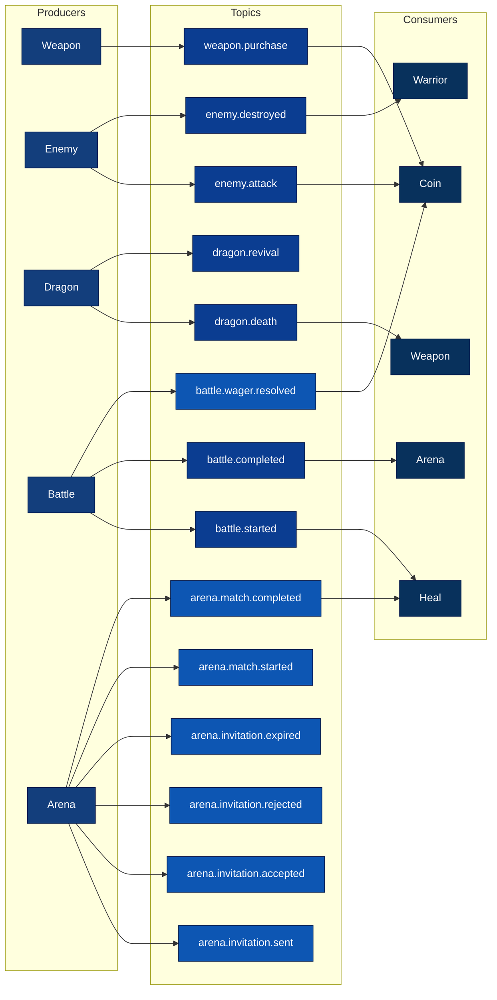
```mermaid
graph LR
    subgraph Topics
        T1[weapon.purchase]
        T2[enemy.attack]
        T3[dragon.death]
        T4[enemy.destroyed]
        T5[dragon.revival]
        T6[battle.started]
        T7[battle.completed]
        T8[arena.invitation.sent]
        T9[arena.invitation.accepted]
        T10[arena.invitation.rejected]
        T11[arena.invitation.expired]
        T12[arena.match.started]
        T13[arena.match.completed]
        T14[battle.wager.resolved]
    end

    subgraph Producers
        P1[Weapon]
        P2[Enemy]
        P3[Dragon]
        P4[Battle]
        P5[Arena]
    end

    subgraph Consumers
        C1[Coin]
        C2[Weapon]
        C3[Warrior]
        C4[Arena]
        C5[Heal]
    end

    P1 --> T1
    P2 --> T2
    P3 --> T3
    P2 --> T4
    P3 --> T5
    P4 --> T6
    P4 --> T7
    P5 --> T8
    P5 --> T9
    P5 --> T10
    P5 --> T11
    P5 --> T12
    P5 --> T13
    P4 --> T14

    T1 --> C1
    T2 --> C1
    T3 --> C2
    T4 --> C3
    T6 --> C5
    T7 --> C4
    T13 --> C5
    T14 --> C1

    style T1 fill:#0b3d91,stroke:#001a4d,color:#ffffff
    style T2 fill:#0b3d91,stroke:#001a4d,color:#ffffff
    style T3 fill:#0b3d91,stroke:#001a4d,color:#ffffff
    style T4 fill:#0b3d91,stroke:#001a4d,color:#ffffff
    style T5 fill:#0b3d91,stroke:#001a4d,color:#ffffff
    style T6 fill:#0b3d91,stroke:#001a4d,color:#ffffff
    style T7 fill:#0b3d91,stroke:#001a4d,color:#ffffff
    style T8 fill:#0d56b3,stroke:#001a4d,color:#ffffff
    style T9 fill:#0d56b3,stroke:#001a4d,color:#ffffff
    style T10 fill:#0d56b3,stroke:#001a4d,color:#ffffff
    style T11 fill:#0d56b3,stroke:#001a4d,color:#ffffff
    style T12 fill:#0d56b3,stroke:#001a4d,color:#ffffff
    style T13 fill:#0d56b3,stroke:#001a4d,color:#ffffff
    style T14 fill:#0d56b3,stroke:#001a4d,color:#ffffff
    style P1 fill:#133e7c,stroke:#001a4d,color:#ffffff
    style P2 fill:#133e7c,stroke:#001a4d,color:#ffffff
    style P3 fill:#133e7c,stroke:#001a4d,color:#ffffff
    style P4 fill:#133e7c,stroke:#001a4d,color:#ffffff
    style P5 fill:#133e7c,stroke:#001a4d,color:#ffffff
    style C1 fill:#08315c,stroke:#001a4d,color:#ffffff
    style C2 fill:#08315c,stroke:#001a4d,color:#ffffff
    style C3 fill:#08315c,stroke:#001a4d,color:#ffffff
    style C4 fill:#08315c,stroke:#001a4d,color:#ffffff
    style C5 fill:#08315c,stroke:#001a4d,color:#ffffff
```

## Deployment Pipeline (Local → Docker → Helm)

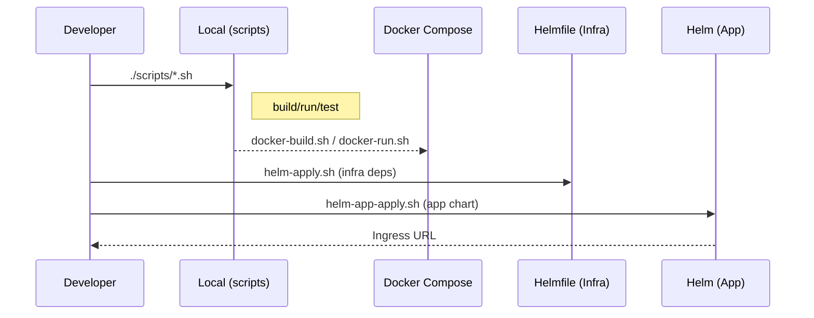
```mermaid
sequenceDiagram
    participant Dev as Developer
    participant Local as Local (scripts)
    participant DC as Docker Compose
    participant Helm as Helmfile (Infra)
    participant Chart as Helm (App)

    Dev->>Local: ./scripts/*.sh
    Note right of Local: build/run/test
    Local-->>DC: docker-build.sh / docker-run.sh
    Dev->>Helm: helm-apply.sh (infra deps)
    Dev->>Chart: helm-app-apply.sh (app chart)
    Chart-->>Dev: Ingress URL
```

## Service Dependencies

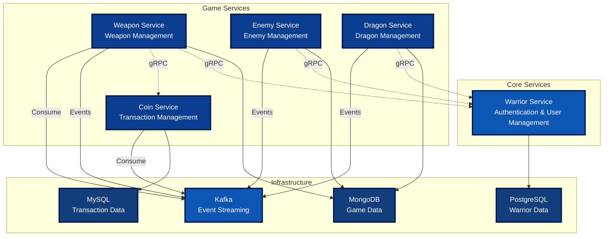
```mermaid
graph TD
    subgraph "Core Services"
        W[Warrior Service<br/>Authentication & User Management]
    end
    
    subgraph "Game Services"
        WP[Weapon Service<br/>Weapon Management]
        C[Coin Service<br/>Transaction Management]
        E[Enemy Service<br/>Enemy Management]
        D[Dragon Service<br/>Dragon Management]
    end
    
    subgraph "Infrastructure"
        K[Kafka<br/>Event Streaming]
        PG[PostgreSQL<br/>Warrior Data]
        MG[MongoDB<br/>Game Data]
        MY[MySQL<br/>Transaction Data]
    end
    
    W --> PG
    WP --> MG
    E --> MG
    D --> MG
    C --> MY
    
    WP -.->|gRPC| W
    E -.->|gRPC| W
    D -.->|gRPC| W
    WP -.->|gRPC| C
    
    WP -->|Events| K
    E -->|Events| K
    D -->|Events| K
    C -->|Consume| K
    WP -->|Consume| K
    
    style W fill:#0d56b3,stroke:#001a4d,stroke-width:3px,color:#ffffff
    style WP fill:#0b3d91,stroke:#001a4d,stroke-width:3px,color:#ffffff
    style C fill:#0b3d91,stroke:#001a4d,stroke-width:3px,color:#ffffff
    style E fill:#0b3d91,stroke:#001a4d,stroke-width:3px,color:#ffffff
    style D fill:#0b3d91,stroke:#001a4d,stroke-width:3px,color:#ffffff
    style K fill:#0d56b3,stroke:#001a4d,stroke-width:3px,color:#ffffff
    style PG fill:#133e7c,stroke:#001a4d,stroke-width:3px,color:#ffffff
    style MG fill:#133e7c,stroke:#001a4d,stroke-width:3px,color:#ffffff
    style MY fill:#133e7c,stroke:#001a4d,stroke-width:3px,color:#ffffff
```

## API Endpoints Overview

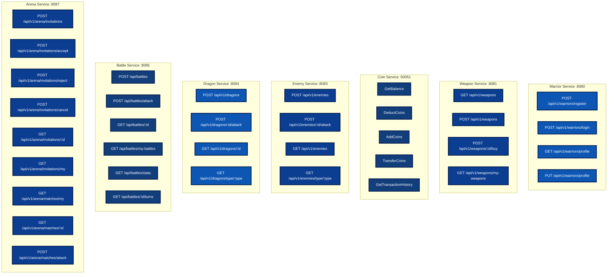
```mermaid
graph TB
    subgraph "Warrior Service :8080"
        W1[POST /api/v1/warriors/register]
        W2[POST /api/v1/warriors/login]
        W3[GET /api/v1/warriors/profile]
        W4[PUT /api/v1/warriors/profile]
    end
    
    subgraph "Weapon Service :8081"
        WP1[GET /api/v1/weapons]
        WP2[POST /api/v1/weapons]
        WP3[POST /api/v1/weapons/:id/buy]
        WP4[GET /api/v1/weapons/my-weapons]
    end
    
    subgraph "Coin Service :50051"
        C1[GetBalance]
        C2[DeductCoins]
        C3[AddCoins]
        C4[TransferCoins]
        C5[GetTransactionHistory]
    end
    
    subgraph "Enemy Service :8083"
        E1[POST /api/v1/enemies]
        E2[POST /api/v1/enemies/:id/attack]
        E3[GET /api/v1/enemies]
        E4[GET /api/v1/enemies/type/:type]
    end
    
    subgraph "Dragon Service :8084"
        D1[POST /api/v1/dragons]
        D2[POST /api/v1/dragons/:id/attack]
        D3[GET /api/v1/dragons/:id]
        D4[GET /api/v1/dragons/type/:type]
    end
    
    subgraph "Battle Service :8085"
        B1[POST /api/battles]
        B2[POST /api/battles/attack]
        B3[GET /api/battles/:id]
        B4[GET /api/battles/my-battles]
        B5[GET /api/battles/stats]
        B6[GET /api/battles/:id/turns]
    end
    
    subgraph "Arena Service :8087"
        A1[POST /api/v1/arena/invitations]
        A2[POST /api/v1/arena/invitations/accept]
        A3[POST /api/v1/arena/invitations/reject]
        A4[POST /api/v1/arena/invitations/cancel]
        A5[GET /api/v1/arena/invitations/:id]
        A6[GET /api/v1/arena/invitations/my]
        A7[GET /api/v1/arena/matches/my]
        A8[GET /api/v1/arena/matches/:id]
        A9[POST /api/v1/arena/matches/attack]
    end
    
    style W1 fill:#0d56b3,stroke:#001a4d,stroke-width:3px,color:#ffffff
    style W2 fill:#0d56b3,stroke:#001a4d,stroke-width:3px,color:#ffffff
    style W3 fill:#0d56b3,stroke:#001a4d,stroke-width:3px,color:#ffffff
    style W4 fill:#0d56b3,stroke:#001a4d,stroke-width:3px,color:#ffffff
    style WP1 fill:#0b3d91,stroke:#001a4d,stroke-width:3px,color:#ffffff
    style WP2 fill:#0b3d91,stroke:#001a4d,stroke-width:3px,color:#ffffff
    style WP3 fill:#0b3d91,stroke:#001a4d,stroke-width:3px,color:#ffffff
    style WP4 fill:#0b3d91,stroke:#001a4d,stroke-width:3px,color:#ffffff
    style C1 fill:#133e7c,stroke:#001a4d,stroke-width:3px,color:#ffffff
    style C2 fill:#133e7c,stroke:#001a4d,stroke-width:3px,color:#ffffff
    style C3 fill:#133e7c,stroke:#001a4d,stroke-width:3px,color:#ffffff
    style C4 fill:#133e7c,stroke:#001a4d,stroke-width:3px,color:#ffffff
    style C5 fill:#133e7c,stroke:#001a4d,stroke-width:3px,color:#ffffff
    style E1 fill:#0b3d91,stroke:#001a4d,stroke-width:3px,color:#ffffff
    style E2 fill:#0b3d91,stroke:#001a4d,stroke-width:3px,color:#ffffff
    style E3 fill:#0b3d91,stroke:#001a4d,stroke-width:3px,color:#ffffff
    style E4 fill:#0b3d91,stroke:#001a4d,stroke-width:3px,color:#ffffff
    style D1 fill:#0d56b3,stroke:#001a4d,stroke-width:3px,color:#ffffff
    style D2 fill:#0d56b3,stroke:#001a4d,stroke-width:3px,color:#ffffff
    style D3 fill:#0d56b3,stroke:#001a4d,stroke-width:3px,color:#ffffff
    style D4 fill:#0d56b3,stroke:#001a4d,stroke-width:3px,color:#ffffff
    style B1 fill:#133e7c,stroke:#001a4d,stroke-width:3px,color:#ffffff
    style B2 fill:#133e7c,stroke:#001a4d,stroke-width:3px,color:#ffffff
    style B3 fill:#133e7c,stroke:#001a4d,stroke-width:3px,color:#ffffff
    style B4 fill:#133e7c,stroke:#001a4d,stroke-width:3px,color:#ffffff
    style B5 fill:#133e7c,stroke:#001a4d,stroke-width:3px,color:#ffffff
    style B6 fill:#133e7c,stroke:#001a4d,stroke-width:3px,color:#ffffff
    style A1 fill:#0b3d91,stroke:#001a4d,stroke-width:3px,color:#ffffff
    style A2 fill:#0b3d91,stroke:#001a4d,stroke-width:3px,color:#ffffff
    style A3 fill:#0b3d91,stroke:#001a4d,stroke-width:3px,color:#ffffff
    style A4 fill:#0b3d91,stroke:#001a4d,stroke-width:3px,color:#ffffff
    style A5 fill:#0b3d91,stroke:#001a4d,stroke-width:3px,color:#ffffff
    style A6 fill:#0b3d91,stroke:#001a4d,stroke-width:3px,color:#ffffff
    style A7 fill:#0b3d91,stroke:#001a4d,stroke-width:3px,color:#ffffff
    style A8 fill:#0b3d91,stroke:#001a4d,stroke-width:3px,color:#ffffff
    style A9 fill:#0b3d91,stroke:#001a4d,stroke-width:3px,color:#ffffff
```

## Game Flow Examples

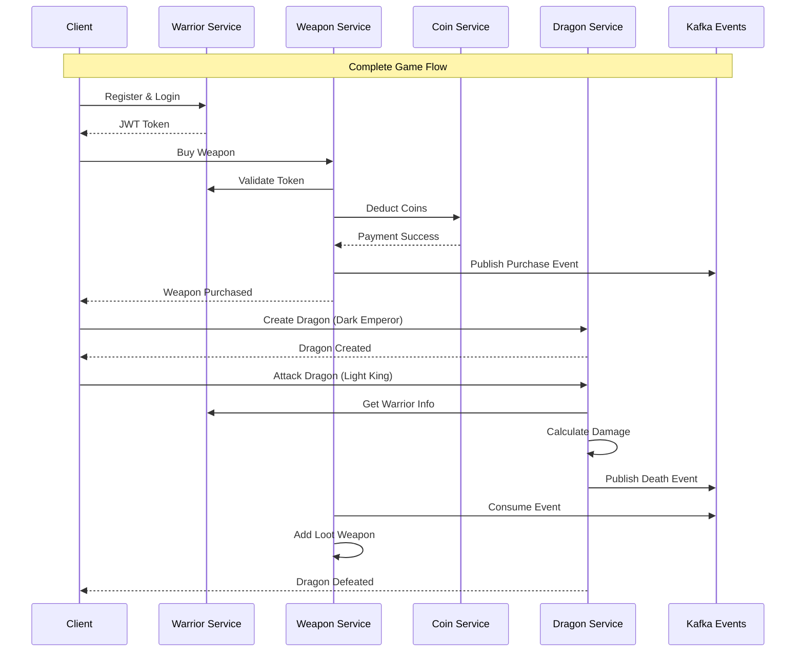
```mermaid
sequenceDiagram
    participant Client
    participant Warrior as Warrior Service
    participant Weapon as Weapon Service
    participant Coin as Coin Service
    participant Dragon as Dragon Service
    participant Kafka as Kafka Events
    
    Note over Client,Kafka: Complete Game Flow
    Client->>Warrior: Register & Login
    Warrior-->>Client: JWT Token
    
    Client->>Weapon: Buy Weapon
    Weapon->>Warrior: Validate Token
    Weapon->>Coin: Deduct Coins
    Coin-->>Weapon: Payment Success
    Weapon->>Kafka: Publish Purchase Event
    Weapon-->>Client: Weapon Purchased
    
    Client->>Dragon: Create Dragon (Dark Emperor)
    Dragon-->>Client: Dragon Created
    
    Client->>Dragon: Attack Dragon (Light King)
    Dragon->>Warrior: Get Warrior Info
    Dragon->>Dragon: Calculate Damage
    Dragon->>Kafka: Publish Death Event
    Weapon->>Kafka: Consume Event
    Weapon->>Weapon: Add Loot Weapon
    Dragon-->>Client: Dragon Defeated
```

## Service Workflows (Detailed Flow Diagrams)

### Warrior Service Workflow

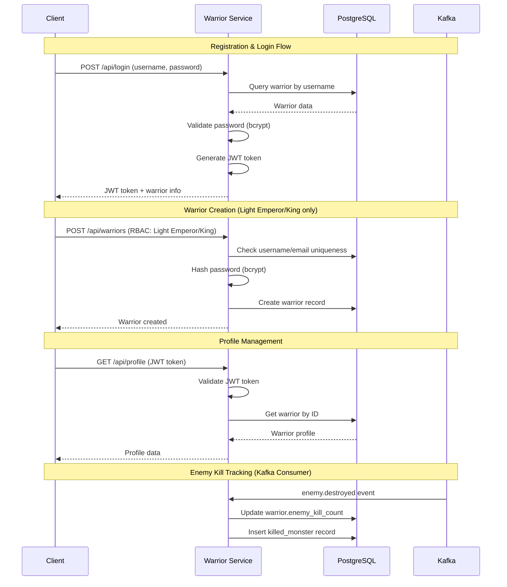
```mermaid
sequenceDiagram
    participant Client
    participant Warrior as Warrior Service
    participant PG as PostgreSQL
    participant Kafka

    Note over Client,Kafka: Registration & Login Flow
    Client->>Warrior: POST /api/login (username, password)
    Warrior->>PG: Query warrior by username
    PG-->>Warrior: Warrior data
    Warrior->>Warrior: Validate password (bcrypt)
    Warrior->>Warrior: Generate JWT token
    Warrior-->>Client: JWT token + warrior info

    Note over Client,Kafka: Warrior Creation (Light Emperor/King only)
    Client->>Warrior: POST /api/warriors (RBAC: Light Emperor/King)
    Warrior->>PG: Check username/email uniqueness
    Warrior->>Warrior: Hash password (bcrypt)
    Warrior->>PG: Create warrior record
    Warrior-->>Client: Warrior created

    Note over Client,Kafka: Profile Management
    Client->>Warrior: GET /api/profile (JWT token)
    Warrior->>Warrior: Validate JWT token
    Warrior->>PG: Get warrior by ID
    PG-->>Warrior: Warrior profile
    Warrior-->>Client: Profile data

    Note over Client,Kafka: Enemy Kill Tracking (Kafka Consumer)
    Kafka->>Warrior: enemy.destroyed event
    Warrior->>PG: Update warrior.enemy_kill_count
    Warrior->>PG: Insert killed_monster record
```

### Weapon Service Workflow

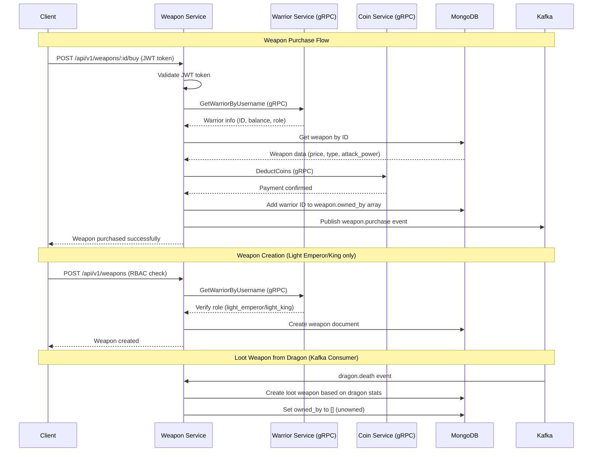
```mermaid
sequenceDiagram
    participant Client
    participant Weapon as Weapon Service
    participant Warrior as Warrior Service (gRPC)
    participant Coin as Coin Service (gRPC)
    participant MongoDB
    participant Kafka

    Note over Client,Kafka: Weapon Purchase Flow
    Client->>Weapon: POST /api/v1/weapons/:id/buy (JWT token)
    Weapon->>Weapon: Validate JWT token
    Weapon->>Warrior: GetWarriorByUsername (gRPC)
    Warrior-->>Weapon: Warrior info (ID, balance, role)
    
    Weapon->>MongoDB: Get weapon by ID
    MongoDB-->>Weapon: Weapon data (price, type, attack_power)
    
    Weapon->>Coin: DeductCoins (gRPC)
    Coin-->>Weapon: Payment confirmed
    
    Weapon->>MongoDB: Add warrior ID to weapon.owned_by array
    Weapon->>Kafka: Publish weapon.purchase event
    Weapon-->>Client: Weapon purchased successfully

    Note over Client,Kafka: Weapon Creation (Light Emperor/King only)
    Client->>Weapon: POST /api/v1/weapons (RBAC check)
    Weapon->>Warrior: GetWarriorByUsername (gRPC)
    Warrior-->>Weapon: Verify role (light_emperor/light_king)
    Weapon->>MongoDB: Create weapon document
    Weapon-->>Client: Weapon created

    Note over Client,Kafka: Loot Weapon from Dragon (Kafka Consumer)
    Kafka->>Weapon: dragon.death event
    Weapon->>MongoDB: Create loot weapon based on dragon stats
    Weapon->>MongoDB: Set owned_by to [] (unowned)
```

### Coin Service Workflow

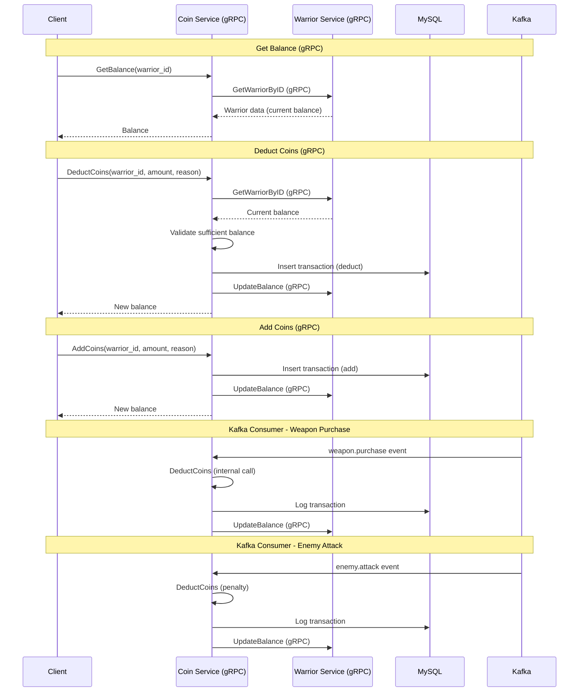
```mermaid
sequenceDiagram
    participant Client
    participant Coin as Coin Service (gRPC)
    participant Warrior as Warrior Service (gRPC)
    participant MySQL
    participant Kafka

    Note over Client,Kafka: Get Balance (gRPC)
    Client->>Coin: GetBalance(warrior_id)
    Coin->>Warrior: GetWarriorByID (gRPC)
    Warrior-->>Coin: Warrior data (current balance)
    Coin-->>Client: Balance

    Note over Client,Kafka: Deduct Coins (gRPC)
    Client->>Coin: DeductCoins(warrior_id, amount, reason)
    Coin->>Warrior: GetWarriorByID (gRPC)
    Warrior-->>Coin: Current balance
    Coin->>Coin: Validate sufficient balance
    Coin->>MySQL: Insert transaction (deduct)
    Coin->>Warrior: UpdateBalance (gRPC)
    Coin-->>Client: New balance

    Note over Client,Kafka: Add Coins (gRPC)
    Client->>Coin: AddCoins(warrior_id, amount, reason)
    Coin->>MySQL: Insert transaction (add)
    Coin->>Warrior: UpdateBalance (gRPC)
    Coin-->>Client: New balance

    Note over Client,Kafka: Kafka Consumer - Weapon Purchase
    Kafka->>Coin: weapon.purchase event
    Coin->>Coin: DeductCoins (internal call)
    Coin->>MySQL: Log transaction
    Coin->>Warrior: UpdateBalance (gRPC)

    Note over Client,Kafka: Kafka Consumer - Enemy Attack
    Kafka->>Coin: enemy.attack event
    Coin->>Coin: DeductCoins (penalty)
    Coin->>MySQL: Log transaction
    Coin->>Warrior: UpdateBalance (gRPC)
```

### Enemy Service Workflow

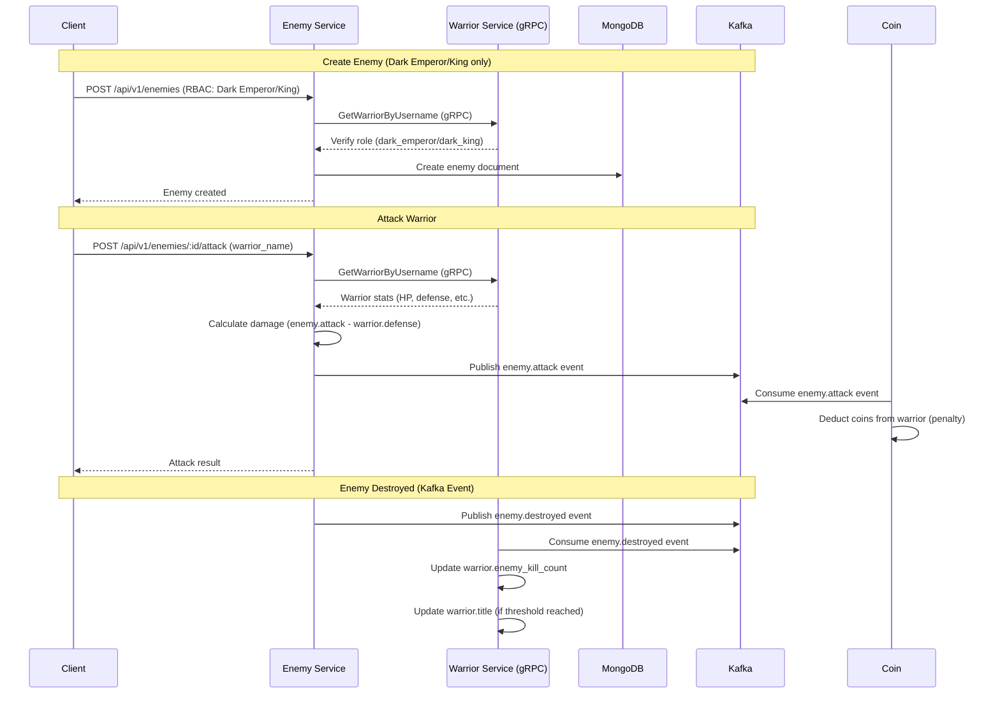
```mermaid
sequenceDiagram
    participant Client
    participant Enemy as Enemy Service
    participant Warrior as Warrior Service (gRPC)
    participant MongoDB
    participant Kafka

    Note over Client,Kafka: Create Enemy (Dark Emperor/King only)
    Client->>Enemy: POST /api/v1/enemies (RBAC: Dark Emperor/King)
    Enemy->>Warrior: GetWarriorByUsername (gRPC)
    Warrior-->>Enemy: Verify role (dark_emperor/dark_king)
    Enemy->>MongoDB: Create enemy document
    Enemy-->>Client: Enemy created

    Note over Client,Kafka: Attack Warrior
    Client->>Enemy: POST /api/v1/enemies/:id/attack (warrior_name)
    Enemy->>Warrior: GetWarriorByUsername (gRPC)
    Warrior-->>Enemy: Warrior stats (HP, defense, etc.)
    Enemy->>Enemy: Calculate damage (enemy.attack - warrior.defense)
    Enemy->>Kafka: Publish enemy.attack event
    Coin->>Kafka: Consume enemy.attack event
    Coin->>Coin: Deduct coins from warrior (penalty)
    Enemy-->>Client: Attack result

    Note over Client,Kafka: Enemy Destroyed (Kafka Event)
    Enemy->>Kafka: Publish enemy.destroyed event
    Warrior->>Kafka: Consume enemy.destroyed event
    Warrior->>Warrior: Update warrior.enemy_kill_count
    Warrior->>Warrior: Update warrior.title (if threshold reached)
```

### Dragon Service Workflow

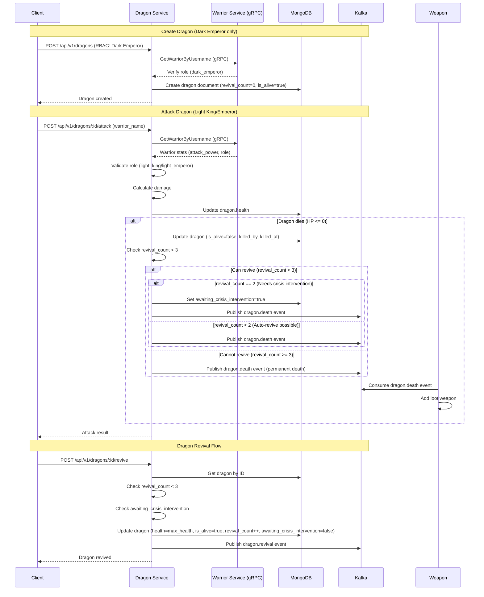
```mermaid
sequenceDiagram
    participant Client
    participant Dragon as Dragon Service
    participant Warrior as Warrior Service (gRPC)
    participant MongoDB
    participant Kafka

    Note over Client,Kafka: Create Dragon (Dark Emperor only)
    Client->>Dragon: POST /api/v1/dragons (RBAC: Dark Emperor)
    Dragon->>Warrior: GetWarriorByUsername (gRPC)
    Warrior-->>Dragon: Verify role (dark_emperor)
    Dragon->>MongoDB: Create dragon document (revival_count=0, is_alive=true)
    Dragon-->>Client: Dragon created

    Note over Client,Kafka: Attack Dragon (Light King/Emperor)
    Client->>Dragon: POST /api/v1/dragons/:id/attack (warrior_name)
    Dragon->>Warrior: GetWarriorByUsername (gRPC)
    Warrior-->>Dragon: Warrior stats (attack_power, role)
    Dragon->>Dragon: Validate role (light_king/light_emperor)
    Dragon->>Dragon: Calculate damage
    Dragon->>MongoDB: Update dragon.health
    
    alt Dragon dies (HP <= 0)
        Dragon->>MongoDB: Update dragon (is_alive=false, killed_by, killed_at)
        Dragon->>Dragon: Check revival_count < 3
        alt Can revive (revival_count < 3)
            alt revival_count == 2 (Needs crisis intervention)
                Dragon->>MongoDB: Set awaiting_crisis_intervention=true
                Dragon->>Kafka: Publish dragon.death event
            else revival_count < 2 (Auto-revive possible)
                Dragon->>Kafka: Publish dragon.death event
            end
        else Cannot revive (revival_count >= 3)
            Dragon->>Kafka: Publish dragon.death event (permanent death)
        end
        Weapon->>Kafka: Consume dragon.death event
        Weapon->>Weapon: Add loot weapon
    end
    
    Dragon-->>Client: Attack result

    Note over Client,Kafka: Dragon Revival Flow
    Client->>Dragon: POST /api/v1/dragons/:id/revive
    Dragon->>MongoDB: Get dragon by ID
    Dragon->>Dragon: Check revival_count < 3
    Dragon->>Dragon: Check awaiting_crisis_intervention
    Dragon->>MongoDB: Update dragon (health=max_health, is_alive=true, revival_count++, awaiting_crisis_intervention=false)
    Dragon->>Kafka: Publish dragon.revival event
    Dragon-->>Client: Dragon revived
```

### Battle Service Workflow

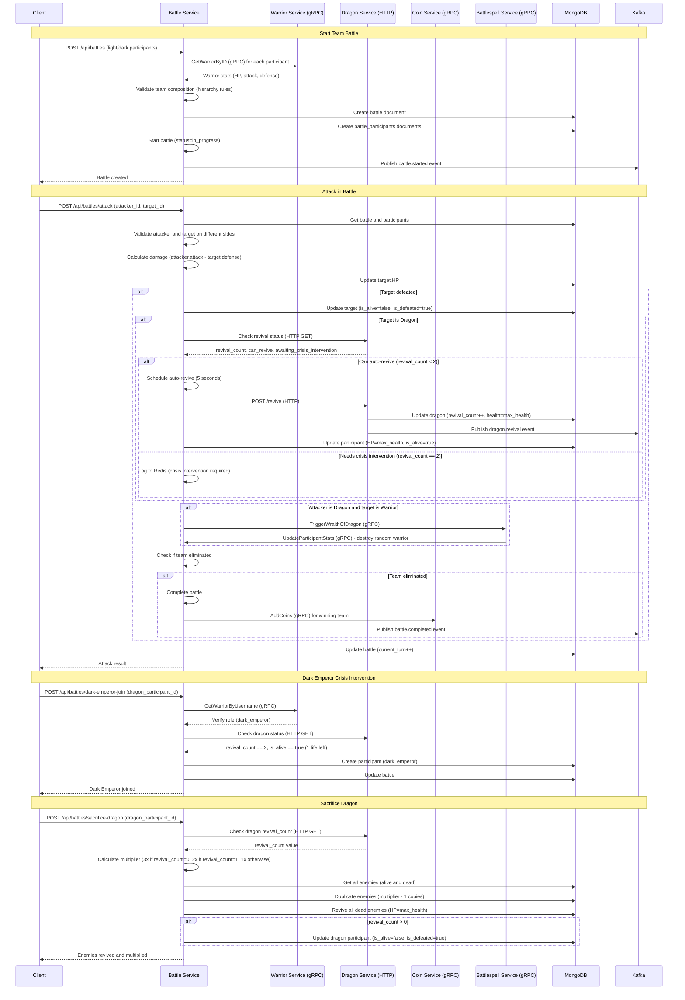
```mermaid
sequenceDiagram
    participant Client
    participant Battle as Battle Service
    participant Warrior as Warrior Service (gRPC)
    participant Dragon as Dragon Service (HTTP)
    participant Coin as Coin Service (gRPC)
    participant Battlespell as Battlespell Service (gRPC)
    participant MongoDB
    participant Kafka

    Note over Client,Kafka: Start Team Battle
    Client->>Battle: POST /api/battles (light/dark participants)
    Battle->>Warrior: GetWarriorByID (gRPC) for each participant
    Warrior-->>Battle: Warrior stats (HP, attack, defense)
    Battle->>Battle: Validate team composition (hierarchy rules)
    Battle->>MongoDB: Create battle document
    Battle->>MongoDB: Create battle_participants documents
    Battle->>Battle: Start battle (status=in_progress)
    Battle->>Kafka: Publish battle.started event
    Battle-->>Client: Battle created

    Note over Client,Kafka: Attack in Battle
    Client->>Battle: POST /api/battles/attack (attacker_id, target_id)
    Battle->>MongoDB: Get battle and participants
    Battle->>Battle: Validate attacker and target on different sides
    Battle->>Battle: Calculate damage (attacker.attack - target.defense)
    Battle->>MongoDB: Update target.HP
    
    alt Target defeated
        Battle->>MongoDB: Update target (is_alive=false, is_defeated=true)
        
        alt Target is Dragon
            Battle->>Dragon: Check revival status (HTTP GET)
            Dragon-->>Battle: revival_count, can_revive, awaiting_crisis_intervention
            
            alt Can auto-revive (revival_count < 2)
                Battle->>Battle: Schedule auto-revive (5 seconds)
                Battle->>Dragon: POST /revive (HTTP)
                Dragon->>MongoDB: Update dragon (revival_count++, health=max_health)
                Dragon->>Kafka: Publish dragon.revival event
                Battle->>MongoDB: Update participant (HP=max_health, is_alive=true)
            else Needs crisis intervention (revival_count == 2)
                Battle->>Battle: Log to Redis (crisis intervention required)
            end
        end
        
        alt Attacker is Dragon and target is Warrior
            Battle->>Battlespell: TriggerWraithOfDragon (gRPC)
            Battlespell->>Battle: UpdateParticipantStats (gRPC) - destroy random warrior
        end
        
        Battle->>Battle: Check if team eliminated
        alt Team eliminated
            Battle->>Battle: Complete battle
            Battle->>Coin: AddCoins (gRPC) for winning team
            Battle->>Kafka: Publish battle.completed event
        end
    end
    
    Battle->>MongoDB: Update battle (current_turn++)
    Battle-->>Client: Attack result

    Note over Client,Kafka: Dark Emperor Crisis Intervention
    Client->>Battle: POST /api/battles/dark-emperor-join (dragon_participant_id)
    Battle->>Warrior: GetWarriorByUsername (gRPC)
    Warrior-->>Battle: Verify role (dark_emperor)
    Battle->>Dragon: Check dragon status (HTTP GET)
    Dragon-->>Battle: revival_count == 2, is_alive == true (1 life left)
    Battle->>MongoDB: Create participant (dark_emperor)
    Battle->>MongoDB: Update battle
    Battle-->>Client: Dark Emperor joined

    Note over Client,Kafka: Sacrifice Dragon
    Client->>Battle: POST /api/battles/sacrifice-dragon (dragon_participant_id)
    Battle->>Dragon: Check dragon revival_count (HTTP GET)
    Dragon-->>Battle: revival_count value
    Battle->>Battle: Calculate multiplier (3x if revival_count=0, 2x if revival_count=1, 1x otherwise)
    Battle->>MongoDB: Get all enemies (alive and dead)
    Battle->>MongoDB: Duplicate enemies (multiplier - 1 copies)
    Battle->>MongoDB: Revive all dead enemies (HP=max_health)
    alt revival_count > 0
        Battle->>MongoDB: Update dragon participant (is_alive=false, is_defeated=true)
    end
    Battle-->>Client: Enemies revived and multiplied
```

### Battlespell Service Workflow

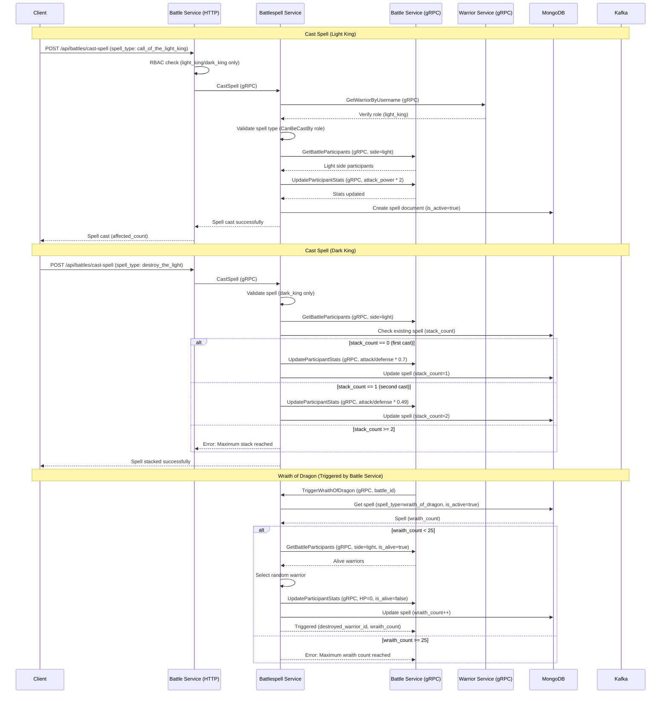
```mermaid
sequenceDiagram
    participant Client
    participant BattleGateway as Battle Service (HTTP)
    participant Battlespell as Battlespell Service
    participant Battle as Battle Service (gRPC)
    participant Warrior as Warrior Service (gRPC)
    participant MongoDB
    participant Kafka

    Note over Client,Kafka: Cast Spell (Light King)
    Client->>BattleGateway: POST /api/battles/cast-spell (spell_type: call_of_the_light_king)
    BattleGateway->>BattleGateway: RBAC check (light_king/dark_king only)
    BattleGateway->>Battlespell: CastSpell (gRPC)
    
    Battlespell->>Warrior: GetWarriorByUsername (gRPC)
    Warrior-->>Battlespell: Verify role (light_king)
    Battlespell->>Battlespell: Validate spell type (CanBeCastBy role)
    Battlespell->>Battle: GetBattleParticipants (gRPC, side=light)
    Battle-->>Battlespell: Light side participants
    Battlespell->>Battle: UpdateParticipantStats (gRPC, attack_power * 2)
    Battle-->>Battlespell: Stats updated
    Battlespell->>MongoDB: Create spell document (is_active=true)
    Battlespell-->>BattleGateway: Spell cast successfully
    BattleGateway-->>Client: Spell cast (affected_count)

    Note over Client,Kafka: Cast Spell (Dark King)
    Client->>BattleGateway: POST /api/battles/cast-spell (spell_type: destroy_the_light)
    BattleGateway->>Battlespell: CastSpell (gRPC)
    Battlespell->>Battlespell: Validate spell (dark_king only)
    Battlespell->>Battle: GetBattleParticipants (gRPC, side=light)
    Battlespell->>MongoDB: Check existing spell (stack_count)
    
    alt stack_count == 0 (first cast)
        Battlespell->>Battle: UpdateParticipantStats (gRPC, attack/defense * 0.7)
        Battlespell->>MongoDB: Update spell (stack_count=1)
    else stack_count == 1 (second cast)
        Battlespell->>Battle: UpdateParticipantStats (gRPC, attack/defense * 0.49)
        Battlespell->>MongoDB: Update spell (stack_count=2)
    else stack_count >= 2
        Battlespell-->>BattleGateway: Error: Maximum stack reached
    end
    
    Battlespell-->>Client: Spell stacked successfully

    Note over Client,Kafka: Wraith of Dragon (Triggered by Battle Service)
    Battle->>Battlespell: TriggerWraithOfDragon (gRPC, battle_id)
    Battlespell->>MongoDB: Get spell (spell_type=wraith_of_dragon, is_active=true)
    MongoDB-->>Battlespell: Spell (wraith_count)
    
    alt wraith_count < 25
        Battlespell->>Battle: GetBattleParticipants (gRPC, side=light, is_alive=true)
        Battle-->>Battlespell: Alive warriors
        Battlespell->>Battlespell: Select random warrior
        Battlespell->>Battle: UpdateParticipantStats (gRPC, HP=0, is_alive=false)
        Battlespell->>MongoDB: Update spell (wraith_count++)
        Battlespell-->>Battle: Triggered (destroyed_warrior_id, wraith_count)
    else wraith_count >= 25
        Battlespell-->>Battle: Error: Maximum wraith count reached
    end
```

### Arena Service Workflow

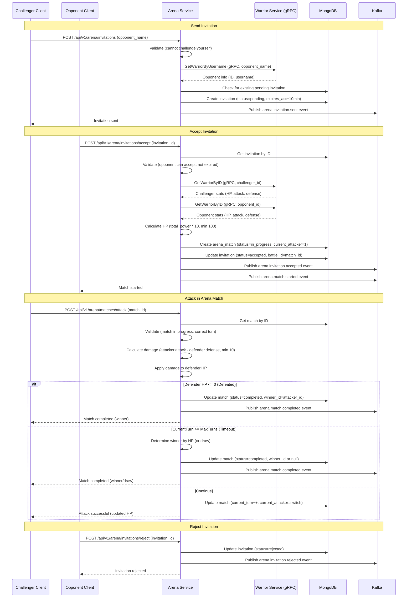
```mermaid
sequenceDiagram
    participant Client1 as Challenger Client
    participant Client2 as Opponent Client
    participant Arena as Arena Service
    participant Warrior as Warrior Service (gRPC)
    participant MongoDB
    participant Kafka

    Note over Client1,Kafka: Send Invitation
    Client1->>Arena: POST /api/v1/arena/invitations (opponent_name)
    Arena->>Arena: Validate (cannot challenge yourself)
    Arena->>Warrior: GetWarriorByUsername (gRPC, opponent_name)
    Warrior-->>Arena: Opponent info (ID, username)
    Arena->>MongoDB: Check for existing pending invitation
    Arena->>MongoDB: Create invitation (status=pending, expires_at=+10min)
    Arena->>Kafka: Publish arena.invitation.sent event
    Arena-->>Client1: Invitation sent

    Note over Client1,Kafka: Accept Invitation
    Client2->>Arena: POST /api/v1/arena/invitations/accept (invitation_id)
    Arena->>MongoDB: Get invitation by ID
    Arena->>Arena: Validate (opponent can accept, not expired)
    Arena->>Warrior: GetWarriorByID (gRPC, challenger_id)
    Warrior-->>Arena: Challenger stats (HP, attack, defense)
    Arena->>Warrior: GetWarriorByID (gRPC, opponent_id)
    Warrior-->>Arena: Opponent stats (HP, attack, defense)
    
    Arena->>Arena: Calculate HP (total_power * 10, min 100)
    Arena->>MongoDB: Create arena_match (status=in_progress, current_attacker=1)
    Arena->>MongoDB: Update invitation (status=accepted, battle_id=match_id)
    Arena->>Kafka: Publish arena.invitation.accepted event
    Arena->>Kafka: Publish arena.match.started event
    Arena-->>Client2: Match started

    Note over Client1,Kafka: Attack in Arena Match
    Client1->>Arena: POST /api/v1/arena/matches/attack (match_id)
    Arena->>MongoDB: Get match by ID
    Arena->>Arena: Validate (match in progress, correct turn)
    Arena->>Arena: Calculate damage (attacker.attack - defender.defense, min 10)
    Arena->>Arena: Apply damage to defender.HP
    
    alt Defender HP <= 0 (Defeated)
        Arena->>MongoDB: Update match (status=completed, winner_id=attacker_id)
        Arena->>Kafka: Publish arena.match.completed event
        Arena-->>Client1: Match completed (winner)
    else CurrentTurn >= MaxTurns (Timeout)
        Arena->>Arena: Determine winner by HP (or draw)
        Arena->>MongoDB: Update match (status=completed, winner_id or null)
        Arena->>Kafka: Publish arena.match.completed event
        Arena-->>Client1: Match completed (winner/draw)
    else Continue
        Arena->>MongoDB: Update match (current_turn++, current_attacker=switch)
        Arena-->>Client1: Attack successful (updated HP)
    end

    Note over Client1,Kafka: Reject Invitation
    Client2->>Arena: POST /api/v1/arena/invitations/reject (invitation_id)
    Arena->>MongoDB: Update invitation (status=rejected)
    Arena->>Kafka: Publish arena.invitation.rejected event
    Arena-->>Client2: Invitation rejected
```

### Arena Service Event Flow

```mermaid
sequenceDiagram
    participant Arena as Arena Service
    participant Kafka as Kafka Events
    participant Consumer as Event Consumers
    
    Note over Arena,Consumer: Invitation Lifecycle Events
    Arena->>Kafka: arena.invitation.sent (challenger, opponent, expires_at)
    Note right of Kafka: Topic: arena.invitation.sent
    
    alt Invitation Accepted
        Arena->>Kafka: arena.invitation.accepted (challenger, opponent, match_id)
        Arena->>Kafka: arena.match.started (player1, player2, match_id)
        Note right of Kafka: Topics: arena.invitation.accepted<br/>arena.match.started
    else Invitation Rejected
        Arena->>Kafka: arena.invitation.rejected (challenger, opponent)
        Note right of Kafka: Topic: arena.invitation.rejected
    else Invitation Expired
        Arena->>Kafka: arena.invitation.expired (challenger, opponent)
        Note right of Kafka: Topic: arena.invitation.expired
    end
    
    Note over Arena,Consumer: Match Completion Event
    Arena->>Arena: Match ends (winner determined)
    Arena->>Kafka: arena.match.completed (player1, player2, winner, match_id)
    Note right of Kafka: Topic: arena.match.completed
    Consumer->>Kafka: Consume match completed (analytics, notifications)
```

### Arena Service Event Types

```mermaid
graph TB
    subgraph "Invitation Events"
        E1[arena.invitation.sent<br/>Challenger sends invitation]
        E2[arena.invitation.accepted<br/>Opponent accepts]
        E3[arena.invitation.rejected<br/>Opponent rejects]
        E4[arena.invitation.expired<br/>10 min timeout]
        E5[arena.invitation.cancelled<br/>Challenger cancels]
    end
    
    subgraph "Match Events"
        E6[arena.match.started<br/>Both players accepted]
        E7[arena.match.completed<br/>Winner determined]
    end
    
    subgraph "Event Flow"
        E1 -->|Opponent accepts| E2
        E1 -->|Opponent rejects| E3
        E1 -->|Timeout| E4
        E1 -->|Challenger cancels| E5
        E2 -->|Match created| E6
        E6 -->|Match ends| E7
    end
    
    style E1 fill:#0b3d91,stroke:#001a4d,color:#ffffff
    style E2 fill:#0d56b3,stroke:#001a4d,color:#ffffff
    style E3 fill:#8b0000,stroke:#001a4d,color:#ffffff
    style E4 fill:#8b0000,stroke:#001a4d,color:#ffffff
    style E5 fill:#8b0000,stroke:#001a4d,color:#ffffff
    style E6 fill:#0b3d91,stroke:#001a4d,color:#ffffff
    style E7 fill:#0d56b3,stroke:#001a4d,color:#ffffff
```

### Heal Service Workflow

```mermaid
sequenceDiagram
    participant Client
    participant Heal as Heal Service
    participant Warrior as Warrior Service (gRPC)
    participant Coin as Coin Service (gRPC)
    participant Kafka
    participant PG as PostgreSQL

    Note over Client,PG: Purchase Healing Package Flow
    Client->>Heal: PurchaseHeal(warrior_id, heal_type, warrior_role)
    Heal->>Warrior: GetWarriorByID (gRPC)
    Warrior-->>Heal: Warrior info (HP, role, is_healing)
    
    alt Warrior is currently healing
        Heal->>Heal: Check healing_until timestamp
        alt Healing not completed
            Heal-->>Client: Error: Already healing (remaining time)
        else Healing completed
            Heal->>Warrior: UpdateWarriorHealingState (clear state)
        end
    end
    
    Heal->>Heal: GetHealPackageByType (role-based validation)
    Heal->>Heal: Validate role can use package (RBAC)
    
    Heal->>Coin: DeductCoins (gRPC, package price)
    Coin-->>Heal: Payment confirmed
    
    Heal->>Warrior: UpdateWarriorHealingState (is_healing=true, healing_until)
    Heal->>PG: Save healing record (duration, completed_at)
    
    Note over Heal: Background goroutine scheduled
    Heal->>Heal: Schedule HP update after duration
    Heal-->>Client: Healing started (duration, coins_spent)
    
    Note over Heal,PG: Healing Completion (Background)
    Heal->>Heal: Wait for duration (15s - 1h)
    Heal->>Warrior: UpdateWarriorHP (gRPC, new HP)
    Warrior-->>Heal: HP updated
    Heal->>Warrior: UpdateWarriorHealingState (is_healing=false)
    Heal->>Heal: Log healing completion
```

### Heal Service Role-Based Packages

```mermaid
graph TB
    subgraph "Warrior Packages"
        WF[Full Heal<br/>100 coins<br/>5 minutes]
        WP[50% Heal<br/>50 coins<br/>3 minutes]
    end
    
    subgraph "Emperor Packages"
        EF[Emperor Full Heal<br/>20 coins<br/>30 seconds]
        EP[Emperor Quick Heal<br/>10 coins<br/>15 seconds]
    end
    
    subgraph "Dragon Package"
        DH[Dragon Heal<br/>1000 coins<br/>1 hour]
    end
    
    subgraph "Roles"
        W[Warrior Role]
        E[Emperor Role<br/>light_emperor<br/>dark_emperor]
        D[Dragon Role]
    end
    
    W --> WF
    W --> WP
    W --> EF
    W --> EP
    
    E --> EF
    E --> EP
    E --> WF
    E --> WP
    
    D --> DH
    D --> WF
    D --> WP
    
    style WF fill:#0d56b3,stroke:#001a4d,color:#ffffff
    style WP fill:#0d56b3,stroke:#001a4d,color:#ffffff
    style EF fill:#0b3d91,stroke:#001a4d,color:#ffffff
    style EP fill:#0b3d91,stroke:#001a4d,color:#ffffff
    style DH fill:#8b0000,stroke:#001a4d,color:#ffffff
    style W fill:#133e7c,stroke:#001a4d,color:#ffffff
    style E fill:#133e7c,stroke:#001a4d,color:#ffffff
    style D fill:#133e7c,stroke:#001a4d,color:#ffffff
```

### Heal Service State Management

```mermaid
stateDiagram-v2
    [*] --> WarriorHealthy: Warrior at full HP
    
    WarriorHealthy --> PurchaseHealing: Battle/Arena completed<br/>HP reduced
    PurchaseHealing --> HealingInProgress: Payment successful<br/>Coins deducted
    
    HealingInProgress --> HealingCompleted: Duration elapsed<br/>HP restored
    HealingInProgress --> BattleBlocked: Attempt to start battle<br/>Check healing state
    
    HealingCompleted --> WarriorHealthy: HP updated
    BattleBlocked --> HealingInProgress: Wait for completion
    
    note right of HealingInProgress
        is_healing = true
        healing_until = timestamp
        Cannot start battles/arena
    end note
    
    note right of HealingCompleted
        is_healing = false
        healing_until = null
        HP updated to target value
    end note
```

### Heal Service Battle/Arena Integration

```mermaid
sequenceDiagram
    participant Client
    participant Battle as Battle Service
    participant Arena as Arena Service
    participant Heal as Heal Service
    participant Warrior as Warrior Service (gRPC)
    participant Kafka

    Note over Client,Kafka: Battle Start with Healing Check
    Client->>Battle: POST /api/battles (start battle)
    Battle->>Warrior: GetWarriorByID (gRPC, participant IDs)
    Warrior-->>Battle: Warrior info (is_healing, healing_until)
    
    alt Warrior is healing
        Battle->>Battle: CheckWarriorCanBattle (validation)
        Battle-->>Client: Error: Warrior is healing (remaining time)
    else Warrior not healing
        Battle->>Battle: Start battle (create participants)
        Battle-->>Client: Battle started
    end
    
    Note over Client,Kafka: Arena Match Start with Healing Check
    Client->>Arena: POST /api/v1/arena/invitations/accept
    Arena->>Warrior: GetWarriorByID (gRPC, challenger_id)
    Warrior-->>Arena: Challenger info (is_healing)
    Arena->>Warrior: GetWarriorByID (gRPC, opponent_id)
    Warrior-->>Arena: Opponent info (is_healing)
    
    alt Challenger or Opponent is healing
        Arena-->>Client: Error: Warrior is healing (cannot start match)
    else Both warriors ready
        Arena->>Arena: Create match
        Arena-->>Client: Match started
    end
    
    Note over Client,Kafka: Battle/Arena Completion Triggers Healing
    Battle->>Kafka: battle.completed event
    Arena->>Kafka: arena.match.completed event
    Heal->>Kafka: Consume battle.completed / arena.match.completed
    Heal->>Heal: Log healing availability (warriors can now heal)
```

### Heal Service Event Flow

```mermaid
sequenceDiagram
    participant Battle as Battle Service
    participant Arena as Arena Service
    participant Kafka as Kafka Events
    participant Heal as Heal Service
    participant Warrior as Warrior Service
    
    Note over Battle,Warrior: Battle Completion Event
    Battle->>Battle: Battle completed (winner determined)
    Battle->>Kafka: battle.completed (winner_id, loser_id, loser_total_power)
    Kafka->>Heal: Consume battle.completed
    Heal->>Heal: Log healing available for warriors
    
    Note over Arena,Warrior: Arena Match Completion Event
    Arena->>Arena: Match completed (winner determined)
    Arena->>Kafka: arena.match.completed (player1_id, player2_id, winner_id)
    Kafka->>Heal: Consume arena.match.completed
    Heal->>Heal: Log healing available for players
    
    Note over Heal,Warrior: Healing Purchase Flow
    Heal->>Warrior: GetWarriorByID (check healing state)
    Warrior-->>Heal: is_healing, healing_until
    Heal->>Heal: Validate healing state
    Heal->>Heal: Purchase healing package
    Heal->>Warrior: UpdateWarriorHealingState (set is_healing=true)
    Heal->>Heal: Schedule HP update after duration
```

### Arena Service Complete Event Flow

```mermaid
stateDiagram-v2
    [*] --> InvitationSent: POST /invitations
    
    InvitationSent --> InvitationAccepted: Opponent accepts
    InvitationSent --> InvitationRejected: Opponent rejects
    InvitationSent --> InvitationExpired: 10 min timeout
    InvitationSent --> InvitationCancelled: Challenger cancels
    
    InvitationAccepted --> MatchStarted: Create match
    MatchStarted --> MatchInProgress: Start battle
    
    MatchInProgress --> MatchCompleted: Winner determined
    MatchInProgress --> MatchCompleted: Timeout (MaxTurns)
    
    InvitationRejected --> [*]
    InvitationExpired --> [*]
    InvitationCancelled --> [*]
    MatchCompleted --> [*]
    
    note right of InvitationSent
        Event: arena.invitation.sent
    end note
    
    note right of InvitationAccepted
        Event: arena.invitation.accepted
    end note
    
    note right of MatchStarted
        Event: arena.match.started
    end note
    
    note right of MatchCompleted
        Event: arena.match.completed
    end note
```

### Arena Service Kafka Event Schema

```mermaid
graph TB
    subgraph "Arena Invitation Sent Event"
        ES[arena.invitation.sent]
        ES1[invitation_id: string]
        ES2[challenger_id: uint]
        ES3[challenger_name: string]
        ES4[opponent_id: uint]
        ES5[opponent_name: string]
        ES6[expires_at: RFC3339]
        ES --> ES1
        ES --> ES2
        ES --> ES3
        ES --> ES4
        ES --> ES5
        ES --> ES6
    end
    
    subgraph "Arena Invitation Accepted Event"
        EA[arena.invitation.accepted]
        EA1[invitation_id: string]
        EA2[challenger_id: uint]
        EA3[opponent_id: uint]
        EA4[battle_id: string]
        EA --> EA1
        EA --> EA2
        EA --> EA3
        EA --> EA4
    end
    
    subgraph "Arena Match Started Event"
        MS[arena.match.started]
        MS1[match_id: string]
        MS2[player1_id: uint]
        MS3[player2_id: uint]
        MS4[battle_id: string]
        MS --> MS1
        MS --> MS2
        MS --> MS3
        MS --> MS4
    end
    
    subgraph "Arena Match Completed Event"
        MC[arena.match.completed]
        MC1[match_id: string]
        MC2[player1_id: uint]
        MC3[player2_id: uint]
        MC4[winner_id: uint?]
        MC5[winner_name: string]
        MC --> MC1
        MC --> MC2
        MC --> MC3
        MC --> MC4
        MC --> MC5
    end
    
    style ES fill:#0b3d91,stroke:#001a4d,color:#ffffff
    style EA fill:#0d56b3,stroke:#001a4d,color:#ffffff
    style MS fill:#0b3d91,stroke:#001a4d,color:#ffffff
    style MC fill:#0d56b3,stroke:#001a4d,color:#ffffff
```

## API Documentation (Swagger/OpenAPI)

Tüm HTTP servisleri için Swagger/OpenAPI dokümantasyonu mevcuttur. Swagger UI ile API endpoint'lerini test edebilir ve detaylı dokümantasyona erişebilirsiniz.

### Swagger UI URL'leri

- **Warrior Service**: http://localhost:8080/swagger/index.html
- **Weapon Service**: http://localhost:8081/swagger/index.html
- **Dragon Service**: http://localhost:8084/swagger/index.html
- **Battle Service**: http://localhost:8085/swagger/index.html

### Swagger Dokümantasyonlarını Generate Etme

Swagger dokümantasyonlarını yeniden oluşturmak için:

```bash
# Otomatik script ile tüm servisler için
./scripts/swagger-gen.sh

# Veya manuel olarak her servis için
cd cmd/warrior && swag init --parseDependency --parseInternal
cd cmd/weapon && swag init --parseDependency --parseInternal
cd cmd/dragon && swag init --parseDependency --parseInternal
cd cmd/battle && swag init --parseDependency --parseInternal
```

### Authentication

Çoğu endpoint JWT token ile korunmaktadır. Swagger UI'da token kullanmak için:

1. Swagger UI'ın sağ üstündeki **"Authorize"** 🔒 butonuna tıklayın
2. `Bearer <your-jwt-token>` formatında token'ı girin
3. Örnek: `Bearer eyJhbGciOiJIUzI1NiIsInR5cCI6IkpXVCJ9...`

Token almak için `/api/login` endpoint'ini kullanabilirsiniz.

### Servis Bazlı Endpoint'ler

#### Warrior Service
- Authentication: Login, Profile
- Warrior Management: CRUD operations (King only)
- Profile: Password change, Killed monsters, Strongest kill
- Role-based: Knights, Archers, Mages listing

#### Weapon Service
- Weapon Listing: Get all weapons, filter by type
- Weapon Purchase: Buy weapons (triggers Kafka events)
- My Weapons: List owned weapons
- Admin: Create weapons (Light Emperor/King only)

#### Dragon Service
- Dragon Management: Create, Attack, Get by ID
- Filtering: Get by type, Get by creator
- Events: Dragon death events published to Kafka

#### Battle Service
- Battle Management: Start battle, Attack, Get battle details
- Battle History: Get battles with RBAC (Emperors see all, Kings see faction, Warriors see own)
- Battle Statistics: Win rate, total battles, coins/experience earned
- Turn-based Combat: Turn history, damage tracking
- Rewards: Automatic coin rewards/penalties via gRPC

### Notlar

- **Coin Service**: gRPC servis olduğu için protobuf dosyalarından dokümantasyon oluşturulabilir (`api/proto/coin/coin.proto`)
- **Enemy Service**: Şu anda HTTP endpoint'leri implement edilmemiştir (sadece Kafka consumer)
- **API Gateway**: Gateway üzerinden erişilen servislerin dokümantasyonları kendi servis portlarından erişilebilir