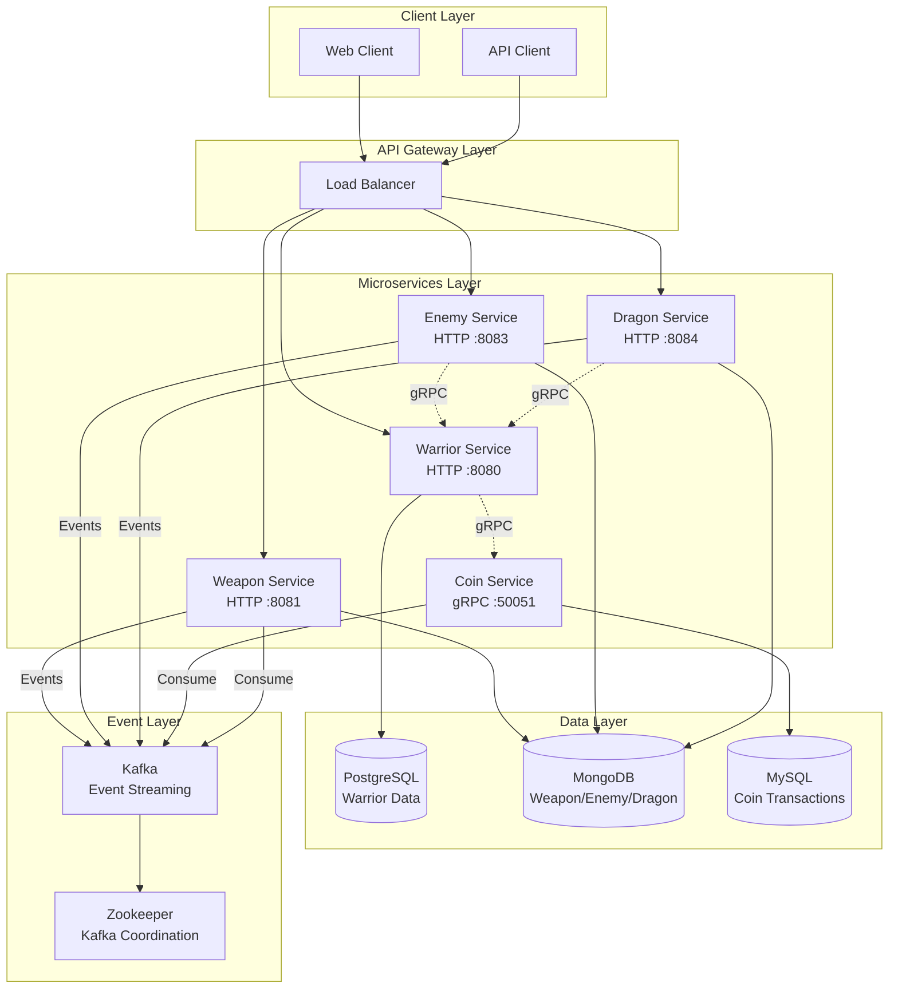
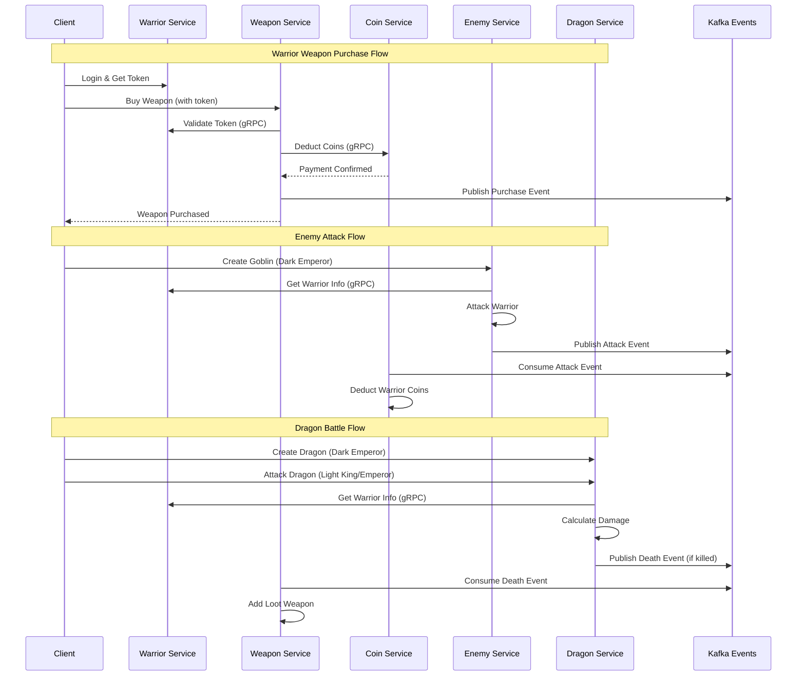
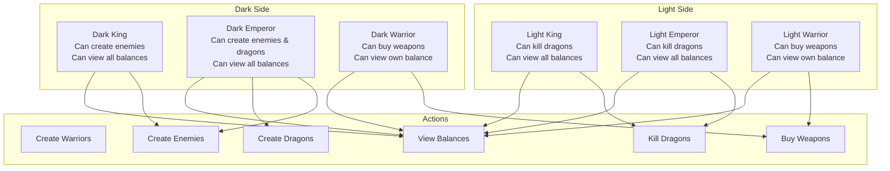
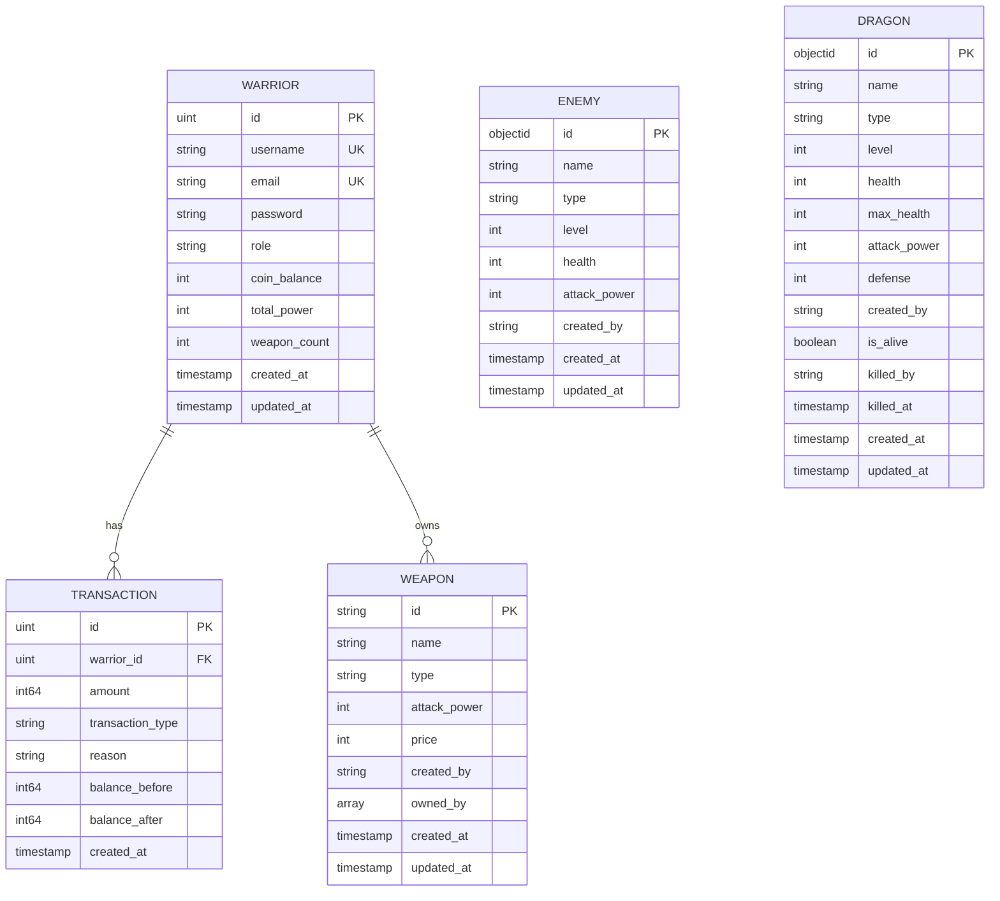
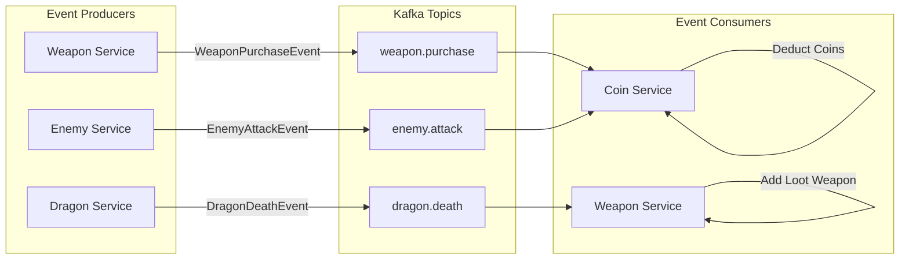
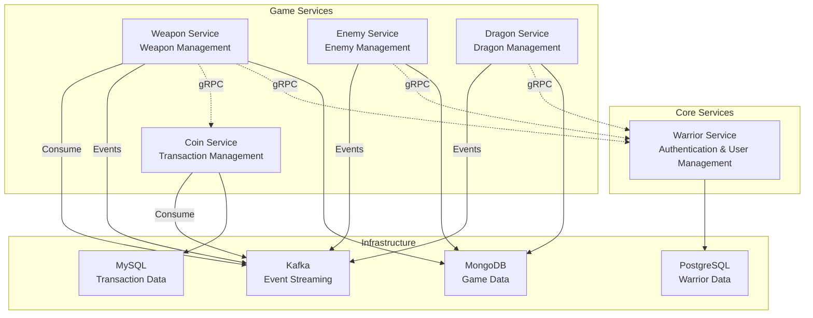
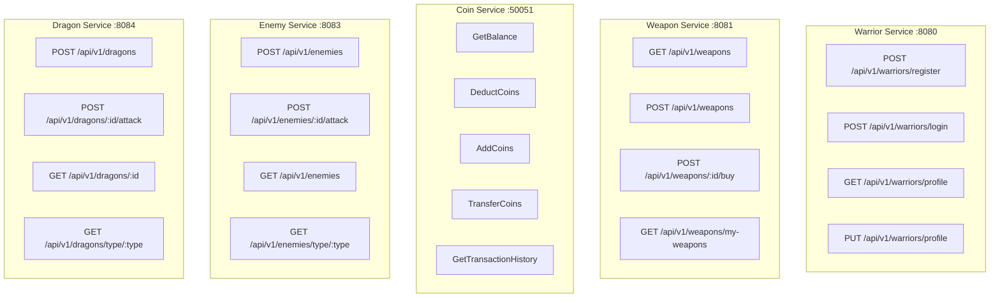

# Empire

A comprehensive microservices-based game system featuring warriors, weapons, coins, enemies, and dragons with role-based access control, gRPC communication, and event-driven architecture using Kafka.

## Architecture Overview



## Service Communication Flow



## Role-Based Access Control (RBAC)



## Database Architecture



## Event-Driven Architecture



## Service Dependencies



## API Endpoints Overview



## Quick Start

### Prerequisites
- Docker & Docker Compose
- Go 1.24+ (for local development)
- Protobuf compiler

### Running with Docker Compose
```bash
# Clone the repository
git clone <repository-url>
cd network-sec-micro

# Start all services
docker-compose up -d

# Check service status
docker-compose ps
```

### Local Development
```bash
# Install dependencies
make install

# Generate protobuf code
make proto

# Build all services
make build

# Run individual services
bash scripts/warrior-run.sh    # Port 8080
bash scripts/weapon-run.sh     # Port 8081
bash scripts/coin-run.sh       # Port 50051
bash scripts/enemy-run.sh      # Port 8083
bash scripts/dragon-run.sh     # Port 8084
```

### Service URLs
- **Warrior Service**: http://localhost:8080
- **Weapon Service**: http://localhost:8081
- **Coin Service**: gRPC localhost:50051
- **Enemy Service**: http://localhost:8083
- **Dragon Service**: http://localhost:8084

## Game Flow Examples

### 1. Warrior Registration & Weapon Purchase
```bash
# Register a warrior
curl -X POST http://localhost:8080/api/v1/warriors/register \
  -H "Content-Type: application/json" \
  -d '{"username":"testwarrior","email":"test@example.com","password":"password123","role":"light_warrior"}'

# Login and get token
curl -X POST http://localhost:8080/api/v1/warriors/login \
  -H "Content-Type: application/json" \
  -d '{"username":"testwarrior","password":"password123"}'

# Buy a weapon
curl -X POST http://localhost:8081/api/v1/weapons/weapon-id/buy \
  -H "Authorization: Bearer <token>"
```

### 2. Dark Emperor Creates Dragon
```bash
# Create a dragon (Dark Emperor only)
curl -X POST http://localhost:8084/api/v1/dragons \
  -H "Authorization: Bearer <dark_emperor_token>" \
  -H "Content-Type: application/json" \
  -d '{"name":"Fire Dragon","type":"fire","level":50}'
```

### 3. Light King Attacks Dragon
```bash
# Attack dragon (Light King/Emperor only)
curl -X POST http://localhost:8084/api/v1/dragons/dragon-id/attack \
  -H "Authorization: Bearer <light_king_token>"
```

## Technology Stack

- **Language**: Go 1.24
- **Web Framework**: Gin
- **Databases**: PostgreSQL, MongoDB, MySQL
- **gRPC**: Inter-service communication
- **Event Streaming**: Apache Kafka
- **Authentication**: JWT
- **Password Hashing**: bcrypt
- **Dependency Injection**: Google Wire
- **Containerization**: Docker & Docker Compose
- **API Documentation**: OpenAPI/Swagger (planned)

## Contributing

1. Fork the repository
2. Create a feature branch
3. Make your changes
4. Add tests if applicable
5. Submit a pull request

## License

This project is licensed under the MIT License - see the LICENSE file for details.